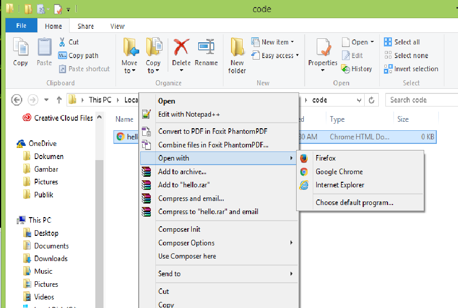
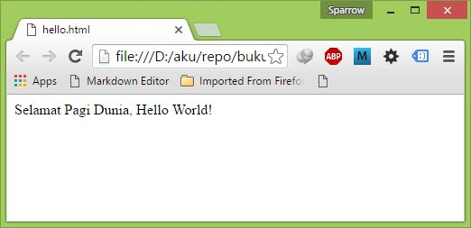

Mukadimah
===========

**HTML** atau Hypertext Markup Language adalah dasar dari semua halaman
web di internet. Jika anda ingin mempelajari cara membuat website, maka
Tutorial Belajar HTML dasar untuk pertamanya sebelum mempelajari lebih
lanjut mengenai pemrograman lainya.

Dalam tutorial ini kita akan mempelajari tentang pengertian HTML, cara
membuat file HTML, berkenalan dengan tag dan atribut HTML, hingga
membahas tag-tag penting HTML, seperti tag &lt;a&gt;, tag &lt;img&gt;,
&lt;table&gt;, dan tag &lt;form&gt; HTML.

Dalam mempelajari HTML, harap diingat bahwa HTML dirancang untuk membuat
struktur dasar dari halaman web. Jika anda ingin merubah tampilan dari
sebuah tag, misalnya ingin membuat background paragraf berwarna merah,
atau ingin memberi efek bayangan pada gambar, sebaiknya menggunakan CSS,
bukan langsung dari HTML.

## Pengertian HTML

HTML adalah singkatan dari Hypertext Markup Language. Disebut hypertext
karena di dalam HTML sebuah text biasa dapat berfungsi lain, kita dapat
membuatnya menjadi link yang dapat berpindah dari satu halaman ke
halaman lainnya dengan hanya meng-klik text tersebut. Kemampuan text
inilah yang dinamakan hypertext, walaupun pada implementasinya nanti
tidak hanya text yang dapat dijadikan link.

Disebut Markup Language karena bahasa HTML menggunakan tanda (mark),
untuk menandai bagian-bagian dari text. Misalnya, text yang berada di
antara tanda tertentu akan menjadi tebal, dan di antara tanda lainnya
akan tampak besar. Tanda ini akan kita kenal di HTML sebagai tag.

HTML merupakan bahasa dasar pembuatan web. Disebut dasar karena dalam
membuat web, jika hanya menggunakan HTML, tampilan web kita akan terasa
hambar. Terdapat banyak bahasa pemograman web yang ditujukan untuk
memanipulasi kode HTML, seperti JavaScript dan PHP. Namun sebelum anda
belajar JavaScript maupun PHP, memahami HTML merupakan hal yang paling
awal.

HTML bukan bahasa pemograman (programming language), tetapi bahasa
markup (markup language), hal ini terdengar sedikit aneh, tapi jika anda
telah mengenal bahasa pemograman lain, dalam HTML tidak akan ditemukan
struktur yang biasa di temukan dalam bahasa pemograman seperti IF, LOOP,
maupun variabel. HTML hanya sebuah bahasa struktur yang fungsinya untuk
menandai bagian-bagian dari sebuah halaman.

Selain HTML, dikenal juga xHTML yang merupakan singkatan dari eXtensible
Hypertext Markup Language. xHTML merupakan versi tambahan dari HTML.
Untuk tahap ini anda boleh menyebut bahwa xHTML itu juga HTML
(Perbedaannya akan kita bahas tutorial Belajar HTML Lanjutan nanti)

File HTML harus dijalankan dari aplikasi web browser.

Pengertian Web Browser
----------------------

Web Browser (atau biasa disebut browser) adalah sebuah software aplikasi
untuk menerima, menampilkan, dan menerjemahkan informasi dari world wide
web (wikipedia). Dan salah satu informasi itu dibuat dalam format HTML.

Kode HTML yang kita buat akan diterjemahkan oleh web browser agar tampil
seperti yang dirancang. Pada dasarnya seluruh web browser dapat
menampilkan kode HTML sama baiknya, namun jika sudah berbicara mengenai
desain halaman, tiap-tiap browser memiliki beberapa perbedaan.

HTML dirancang dan diatur oleh sebuah badan standarisasi dunia yang
khusus menangani web, yaitu W3C (World Wide Web Consortium). Hal ini
dikarenakan tiap-tiap program web browser menerjemahkan kode-kode HTML
secara berbeda-beda, sehingga di perlukan sebuah standar yang sama untuk
seluruh browser.

Namun pada penerapannya, standar ini hanya merupakan rekomendasi.
Beberapa web browser membuat aturannya sendiri.

Salah satu yang terkenal adalah Internet Explorer pada sekitar tahun
2000-an. Hampir 90% web browser yang digunakan saat itu adalah Internet
Explorer, dan IE tidak sepenuhnya mengikuti rekomendasi W3C. Sedangkan
web browser Opera yang mencoba menerapkan standar W3C tidak terlalu
populer. Perbedaan aturan penerjemahan HTML di antara web browser inilah
yang terus menjadi tantangan bagi programmer web.

Sekarang Internet Explorer tidak lagi sekuat dulu. Web Browser Mozilla
Firefox dan Google Chrome telah menguasai lebih dari 50%, dan IE juga
telah berusaha menerapkan standar W3C.

### Fungsi Web Browser

Untuk mempelajari HTML, web browser adalah perangkat utama yang kita
butuhkan. Ibarat bahasa pemograman lainnya, Web Browser adalah compiler
dan intrepreter HTML. Anda bebas menggunakan web browser yang disukai.

Selain web browser, aplikasi lain yang kita butuhkan untuk mempelajari
HTML adalah sebuah text editor.

Memilih Aplikasi Editor HTML
-----------------------------

Memilih sebuah aplikasi editor HTML tidaklah terlalu sulit. Aplikasi
editor HTML digunakan untuk mempermudah kita membuat kode HTML. HTML
sendiri pada dasarnya hanya text biasa yang ditulis dalam kode-kode
khusus. Web Browser-lah yang akan menerjemahkan kode HTML ini menjadi
sebuah tampilan halaman web.

Untuk membuat kode HTML maupun halaman web sederhana, kita tidak perlu
menggunakan aplikasi yang besar dan berat. Aplikasi Notepad bawaan
Windows sudah cukup untuk membuat kode HTML. Namun untuk tutorial
belajar HTML ini saya akan menggunakan aplikasi Notepad++[^1].

Berikut ini beberapa daftar editor yang dapat digunakan untuk membantu
membuat kode html.

-   Notepad

-   Notepad++

-   sublime Text[^2]

-   Atom[^3]

[^1]: http://notepad-plus-plus.org/download/

[^2]: text

[^3]: http://atom.io

> **Catatan**
>
> Saya tidak menyarankan untuk menggunakan aplikasi editor yang
> memudahakan pembuatan editor html otomatis sperti Adobe Dreanwever,
> ckeditor ataupun yang lainya, karena hal ini akan menyebabkan kita tak
> memmahami sintaks dari HTML.

Untuk memudahkan dalam mengakses file, sebaiknya buat sebuah folder
“Belajar-HTML” di Drive D. Folder ini akan kita jadikan tempat seluruh
halaman HTML yang akan dibuat.

Selanjutnya, buka aplikasi Notepad++ , atau aplikasi text editor
lainnya, lalu ketik text berikut ini:

    Selamat Pagi Dunia, Hello World!

Lalu save sebagai hello.html pada folder Belajar-HTML. Setelah itu
jalankan file hello.html kita dengan cara double klik file tersebut,
atau klik kanan -&gt; Open With -&gt; Firefox (Jika anda menggunakan web
browser firefox) seperti pada gambar  berikut ini

Maka akan muncul tampilan seperti pada gambar berikut ini

Dari percobaan ini kita dapat melihat bahwa setiap halaman HTML harus
diakhiri dengan extensi .html. Anda mungkin juga akan menemukan bahwa
beberapa halaman juga memiliki ekstensi .htm, eksetensi ini digunakan
untuk mendukung Windows versi lama yang masih menggunakan ekstensi 3
huruf di belakang sebuah file.

> Apa yang kita lakukan disini adalah menjalankan file HTML dari
> komputer lokal. Perhatikan bagian alamat pada web browser, diawali
> dengan “file:///” lalu diikuti dengan alamat file HTML yang disimpan
> dalam komputer, misalnya: “D:/BelajarHTML/hello.html“.

