Penulisan HTML
===============

Paragraf
-------------

Untuk memahami cara pembuatan paragraf di dalam HTML, kita akan
menggunakan contoh struktur HTML yang dibuat pada tutorial sebelum ini,
dan menambahkan beberapa text. Silahkan buka kembali text editor, lalu
ketikkan kode berikut:

Contoh penggunaan tag paragraf:

```html
<!DOCTYPE html>
<html>
<head>
<title>Title dari Websiteku</title>
</head>
<body>
Ini adalah paragraf pertama
Ini adalah paragraf kedua
</body>
</html>
```

Save sebagai paragraf.html, lalu jalankan di web browser.


### Cara Membuat Paragraf di HTML


Kita akan melihat bahwa paragraf tersebut tidaklah berada pada baris
berbeda, namun berada pada satu baris yang sama. Dalam HTML, spasi akan
diabaikan, termasuk jika kita merubahnya menjadi :

Contoh penggunaan tag paragraf 2:

```html
<!DOCTYPE html>
<html>
<head>
<title>Title dari Websiteku</title>
</head>
<body>
Ini adalah paragraf pertama 	Ini adalah paragraf kedua
</body>
</html>
```

Kita harus memberi tahu web browser bahwa kedua kalimat itu harus
terpisah. Dan bahwa masing-masing kalimat itu adalah sebuah paragraf.

### Tag Paragraf (`<p>`)

HTML menyediakan tag khusus untuk membuat paragraf. Penulisannya
menggunakan huruf p, sebagai berikut : `<p>`. Mari kita revisi
contoh kode HTML sebelumnya, dan menambahkan tag `<p>`.

Contoh penggunaan tag paragraf 3:

```html
<!DOCTYPE html>
<html>
<head>
<title>title dari websiteku</title>
</head>
<body>
<p>ini adalah paragraf pertama</p>
<p>ini adalah paragraf kedua</p>
</body>
</html>
```


Maka kali ini kita akan melihat bahwa kedua paragraf itu sudah berada
pada posisi masing-masing. Setiap tag paragraf, web browser akan
memberikan spasi antar paragraf.

### Tag Break (`<br>`)

Cara lain untuk memisahkan kedua paragraf adalah dengan menggunakan tag
`<br>` (br singkatan dari break).

Contoh penggunaan tag `<br>`:

```html
<!DOCTYPE html>
<html>
<head>
<title>title dari websiteku</title>
</head>
<body>
ini adalah paragraf pertama
<br />
ini adalah paragraf kedua
</body>
</html>
```

Jika kode HTML diatas dijalankan, maka hasilnya hampir sama dengan
menggunakan tag `<p>`. Namun pemisahan paragraf menggunakan tag
`<br>` bukanlah untuk membuat paragraf. Tag `<br>` berfungsi
untuk memisahkan sebuah bagian text dengan text lain. Jika yang kita
butuhkan adalah struktur paragraf, maka gunakan tag `<p>`.

Perhatikan penulisan tag `<br>`, tag break adalah salah satu dari
beberapa tag yang tidak memiliki tag penutup, dan bisa ditulis
sebagai `<br >` atau `<br />`. Penulisan `<br />` merupakan
bawaan dari xHTML yang dianggap lebih rapi. Namun dalam standar HTML5,
penulisan `<br>` maupun `<br />` tetap dianggap valid.

### Tag untuk penebalan dan garis miring (`<em>` dan `<strong>`)

Di dalam sebuah paragraf, kadang kita perlu untuk membuat penekanan pada
kata-kata tertentu. Penekanan ini bisa dilakukan dengan menebalkan kata,
atau dengan garis miring.

Tag emphasis (penekanan) terdiri dari 2 tag, `<em>` untuk emphasis,
dan `<strong>` untuk strong emphasis.

Pada umumnya web browser akan menampilkan `<em>` sebagai garis
miring, dan `<strong>` dengan penebalan huruf.

Contoh penggunaan tag `<em>` dan `<strong>`:

```html
<!DOCTYPE html>
<html>
<head>
<title>title dari websiteku</title>
</head>
<body>
<p>ini adalah kalimat <em>pertama</em>, 
sedangkan ini adalah kalimat <strong>kedua</strong></p>
</body>
</html>
```
### Cara penggunaan tag em dan strong

Walaupun tanda spasi tidak akan dianggap dalam HTML, namun untuk membuat
kode HTML, menjorokkan (indent) beberapa baris dalam suatu tag akan
membuat kode mudah dibaca.

Kita juga akan menemukan bahwa HTML memiliki tag `<i>` (italic)
untuk memiringkan huruf, dan `<b>` (bold) untuk menebalkan huruf.
Pakar HTML yang mendukung pemisahan konten dengan tampilan tidak
menyarankan menggunakan tag `<i>` dan `<b>`, karena kedua tag
ini akan mempengaruhi tampilan dari HTML. Tampilan halaman web
seharusnya di tangani oleh CSS, bukan di dalam kode HTML. Pada xHTML,
tag `<i>` dan `<b>` sudah dianggap usang, dan tidak akan dipakai
lagi, namun dalam spesifikasi HTML5, tag `<i>` dan `<b>` kembali
dianggap relevan.

Judul (heading) di HTML
------------------------

HTML menyediakan tag khusus untuk membuat judul atau di dalam HTML lebih
di kenal dengan istilah: heading. Heading dirancang terpisah dari
paragraf. Tag Heading biasanya digunakan untuk judul dari paragraf, atau
bagian dari text yang merupakan judul.

Tag heading di dalam HTML terdiri dari 6 tingkatan, yaitu `<h1>`,
`<h2>`, `<h3>`, `<h4>`, `<h5>`, dan `<h6>`. Tag
heading secara default akan ditampilkan oleh web browser dengan huruf
tebal (bold). Tampilan dari tag header juga dibuat bertingkat. Tag
header `<h1>` memiliki ukuran huruf paling besar, sedangkan
`<h6>` terkecil.

Berikut adalah contoh penggunaan tag heading di dalam HTML:

```html
<!DOCTYPE html>
<html>
<head>
<title>penggunaan tag heading</title>
</head>
<body>
<h1>ini adalah judul dengan h1 </h1>
<h2>ini adalah judul dengan h2 </h2>
<h3>ini adalah judul dengan h3 </h3>
<h4>ini adalah judul dengan h4 </h4>
<h5>ini adalah judul dengan h5 </h5>
<h6>ini adalah judul dengan h6 </h6>
</body>
</html>
```

### Cara Membuat Judul di HTML

Biasanya dalam sebuah halaman akan ada hanya 1 tag `<h1>`, dan
beberapa tag `<h2>` dan `<h3>` dengan beberapa tag `<p>`.
Berikut adalah contoh struktur artikel HTML sederhana dengan menggunakan
tag `<p>` dan beberapa tag heading:

Dengan menggunakan beberapa tag heading dan paragraf, kita bisa membuat
struktur sederhana konten HTML.

Search Engine seperti Google akan memberikan nilai lebih untuk heading.
Biasanya semakin tinggi tingkat heading, semakin tinggi pula penekanan
search engine. Tag `<h1>` dianggap lebih bernilai dari pada
`<h2>`. Tag `<h1>` umumnya digunakan untuk judul sebuah konten /
artikel, sehingga dianggap dapat mewakili keseluruhan artikel.

Daftar/List di HTML
-------------------

Dalam HTML, tag list terdiri dari 2 jenis, ordered list (berurutan) dan
unordered list (tidak berurutan). Ordered list akan ditampilkan dengan
angka atau huruf, sedangkan unordered list dengan bulatan atau kotak.

Ordered list menggunakan tag `<ol>`, dan unordered list menggunakan
tag `<ul>`, sedangkan untuk list sendiri menggunakan tag `<li>`.
Penjelasan ini akan lebih mudah jika menggunakan contoh.

Berikut adalah contoh kode HTML untuk membuat ordered list menggunakan
tag `<ol>`:

```html
<!DOCTYPE html>
<html>
<head>
<title>penggunaan tag list </title>
</head>
<body>
<h1>daftar belanjaan</h1>
<ol>
<li>minyak goreng</li>
<li>sabun mandi</li>
<li>deterjen</li>
<li>shampoo</li>
<li>obat nyamuk</li>
</ol>
</body>
</html>
```


Untuk membuat unordered list, tinggal ganti tag `<ol>` menjadi
`<ul>`.

Berikut adalah contoh kode HTML untuk membuat unordered list menggunakan
tag `<ul>`:

```html
<!DOCTYPE html>
<html>
<head>
<title>penggunaan tag list </title>
</head>
<body>
<h1>daftar belanjaan</h1>
<ul>
<li>minyak goreng</li>
<li>sabun mandi</li>
<li>deterjen</li>
<li>shampoo</li>
<li>obat nyamuk</li>
</ul>
</body>
</html>
```


Penggunaan tag list pada HTML tidak
hanya untuk membuat daftar saja. Dengan CSS, tag list dapat digunakan
untuk membuat menu navigasi di dalam halaman web, seperti menu home,
contact us, dll. Tag list juga dapat digunakan untuk nested list, atau
list bersarang, yang artinya sebuah list yang berada di dalam list
lainnya.

### Description List dalam HTML

Description List adalah jenis list yang ditujukan untuk membuat struktur
yang berisi deskripsi atau daftar penjelasan.

List jenis ini mungkin tidak sepopuler ordered list atau unordered list,
namun jika anda membutuhkan struktur HTML untuk membuat list yang berisi
penjelasan istilah-istilah dengan keterangannya, mungkin bisa
menggunakan list jenis ini.

#### Cara Membuat Description List dalam HTML

Untuk membuat Description List, seluruh list harus berada di dalam
pasangan tag `<dl>` dan `</dl>`. Untuk setiap deskripsi atau
judul istilah, kita menggunakan tag `<dt>`. Sedangkan untuk
penjelasan istilah tersebut, kita menggunakan tag `<dd>`.

Berikut adalah contoh kode program description list dalam HTML:

```html
<!DOCTYPE html>
<html>
<head>
<title>Belajar HTML di turahe</title>
</head>
<body>
<h3 id="judul1">Saya sedang belajar HTML di turahe.github.io</h3>

<dl>
<dt>HTML</dt>
<dd>HTML adalah singkatan dari Hypertext Markup Language.</dd>
<dt>CSS</dt>
<dd>CSS adalah singkatan dari Cascading Style Sheet.</dd>
<dt>PHP</dt>
<dd>PHP adalah singkatan dari PHP: Hypertext Preprocessor.</dd>
</dl>

</body>
</html>
```

 

- Tag dd, dt, dan
dlPerhatikan cara penulisan description list diatas, untuk setiap tag
`<dt>`, diikuti oleh tag `<dd>`. Namun kita bisa juga
menambahkan beberapa tag <dd> pada satu tag `<dt>`, dan
demikian juga sebaliknya.

Di dalam web browser, isi dari penjelasan pada tag <dd> akan
ditampilkan dengan sedikit menjorok (indent) dari bagian istilahnya.

> Untuk memudahkan mengingat, tag `<dt>` bisa disebut sebagai ‘data
> term’, dan tag `<dd>` sebagai ‘data description’.

link di HTML
--------------------------

Tujuan kata Hypertext dari HTML adalah membuat sebuah text yang ketika
di-klik akan pindah ke halaman lainnya. HTML menggunakan tag
`<a>` untuk keperluan ini.

Link ditulis dengan `<a>` yang merupakan singkatan cari anchor
(jangkar). Setiap tag `<a>` setidaknya memiliki sebuah atribut href.
Dimana href berisi alamat yang dituju (href adalah singkatan dari
hypertext reference).

Agar lebih jelas, kita akan lihat menggunakan contoh. Silahkan buka text
editor dan buat kode seperti dibawah ini.

Contoh penggunaan tag link `<a>`:

```html
<!DOCTYPE html>
<html>
<head>
<title>Penggunaan Tag Link </title>
</head>
<body>
<h1>Belajar Tag Link</h1>
<p>Saya sedang belajar HTML dari 
<a href="http://turahe.github.io">turahe</a></p>
</body>
</html>
```

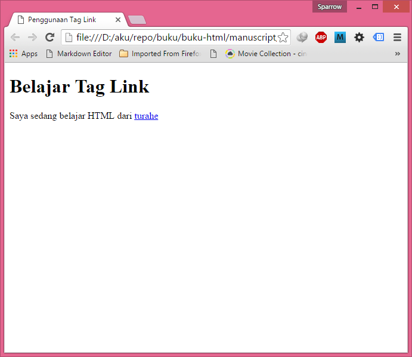

### Alamat Absulut dan Alamat Relatif

Pada contoh diatas kita menuliskan alamat link secara lengkap dengan
bagian `"http://www."`. Penulisan seperti ini disebut juga dengan external
link, yang berarti kita membuat link ke alamat lain di internet, atau
lebih dikenal dengan: alamat absolut.

Alamat absolut adalah penulisan alamat file dengan menyertakan nama
website, seperti: `href="http://turahe.github.io/belajar_html.html"`,
atau `href="http://www.wikipedia.org"`.

Namun jika kita ingin membuat link di dalam situs yang sama, maka tidak
perlu menyebutkan alamat lengkap tersebut. Tetapi cukup mencantumkan
alamat file yang dituju relatif kepada file saat ini. Jenis alamat ini
disebut alamat relatif.

Sebagai contoh alamat relatif, apabila kita ingin membuat link kepada
file hello.html pada folder yang sama dengan file saat ini, maka atribut
hrefnya, berisi: href="hello.html". Berikut adalah kode HTMLnya:

Contoh penggunaan tag link `<a>` untuk alamat relatif:

```html
<!DOCTYPE html>
<html>
<head>
<title>Penggunaan Tag Link </title>
</head>
<body>
<h1>Belajar Tag Link</h1>
<p>Halaman HTML pertama saya adalah <a href="hello.html">Hello</a></p>
</body>
</html>
```

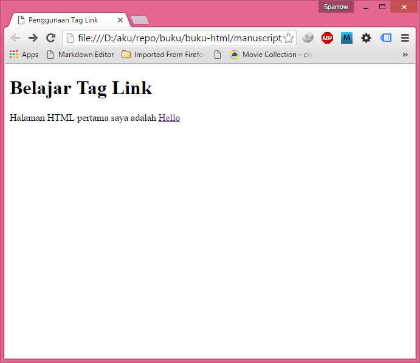

Alamat absolute ditulis dengan lengkap, seperti
`http://turahe.github.io`, atau jika kita merujuk kepada halaman
tertentu, menjadi `http://turahe.github.io/nama_halaman.html`.

Alamat relatif maksudnya adalah relatif kepada file tempat kita
memanggil link ini. Seandainya nama file kita adalah `belajar_link.html`,
dan dalam folder yang sama terdapat halaman `belajar_list.html`, kita
dapat menggunakan `href="belajar_list.html"` untuk membuat link ke
halaman `belajar_list.html` .

Jika file tersebut berada di dalam folder `lagi_belajar`, maka alamat
relatifnya menjadi `href="lagi_belajar/belajar_list.html"`. Namun
bagaimana jika halaman tersebut berada 2 tingkat di luar folder saat
ini? Kita dapat menggunakan `href="../../belajar_list.html"`, untuk naik
2 folder diatasnya.

### Atribut tag `<a>`: target

Atribut penting lainnya dari tag `<a>` adalah target. Atribut ini
digunakan untuk menentukan apakah link yang dituju terbuka di jendela
browser saat ini, atau terbuka di jendela baru.

Secara default, setiap link yang kita tulis akan terbuka pada jendela
yang sama (menimpa halaman web saat ini). Tetapi apabila kita ingin
halaman tersebut terbuka pada tab baru, gunakan atribut
`target="_blank"`.

Contoh penggunaan tag link `<a>` dengan atribut target:

```html
<!DOCTYPE html>
<html>
<head>
<title>Penggunaan Tag Link </title>
</head>
<body>
<h1>Belajar Tag Link</h1>
<p>Saya sedang belajar html dari <a href="http://turahe.github.io"
target="_blank">turahe</a> dan akan terbuka pada tab baru</p>
</body>
</html>
```

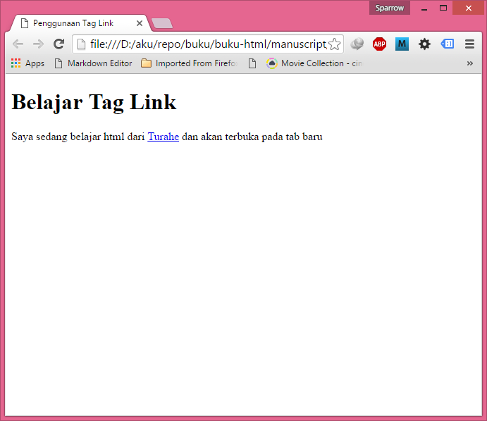

Jika kita men-klik link tersebut, maka halaman turahe.github.io akan
terbuka di tab baru, dan tidak menimpa tab saat ini.

### Membuat Internal Link ke Bagian Lain Dokumen (atribut id)

Jika pada tutorial HTML Dasar kita telah mempelajari cara membuat link
ke halaman lain (baik link dengan alamat absolut maupun alamat relatif),
kita juga bisa membuat link ke bagian lain dari dokumen yang sama. Dalam
Tutorial HTML Lanjutan kali ini kita akan mempelajari Cara Membuat
Internal Link ke Bagian Lain Dokumen dengan menggunakan atribut id.

#### Mengenal Atribut id dalam HTML

Atribut id adalah atribut yang bisa diberikan kepada tag apapun di dalam
HTML. Atribut id bisa diibaratkan sebagai ‘identitas’ dari sebuah tag.
Di dalam sebuah halaman, tidak boleh ada atribut id yang sama, namun
setiap tag tidak harus memiliki atribut id. Berikut adalah contoh
penulisan atribut id dalam beberapa tag HTML:

```html
<!DOCTYPE html>
<html>
<head>
<title>Penggunaan Tag Link </title>
</head>
<body>
<h1>Belajar Tag Link</h1>
<p>Saya sedang belajar html dari <a href="http://www.turahe.com"
target="_blank">turahe</a> dan akan terbuka pada tab baru</p>
</body>
</html>

```
```html
<p id="paragraf1"> </p> <a id="situs1"
href="http://turahe.github.io">Situs turahe</a>  <div
id="footer"></div> 
```

Atribut id kebanyakan digunakan untuk
pengkodean dengan CSS atau pemograman JavaScript, dan atribut ini tidak
akan berpengaruh apa-apa kedalam tampilan text HTML.

#### Cara Membuat Link ke Bagian Lain Dokumen HTML

Selain digunakan di dalam CSS dan JavaScript, atribut id juga digunakan
di dalam HTML sebagai ‘penanda’ bagian dari halaman web.

Apabila paragraf pertama dari halaman kita memiliki `id="paragraf1"`, maka
kita bisa membuat link yang akan ‘memindahkan’ jendela web browser ke
bagian `"paragraf1"`, dengan menuliskan:

```html
<a href="\#paragraf1">Kembali ke paragraf pertama</a> 
```

Jika
bagian tersebut dijalankan, web browser akan menampilkannya seperti link
‘normal’, namun ketika user men-klik kalimat link tersebut, ia akan
dipindahkan ke bagian halaman yang memiliki `id="paragraf1"`. Perhatikan
bahwa di dalam tag `<a>`, kita menggunakan tanda pagar "#" untuk
berpindah ke bagian lain halaman.

Syarat dari link tersebut bisa berfungsi adalah di bagian lain halaman,
harus ada tag yang memiliki atribut `id="paragraf1"`.

Selain digunakan untuk pindah ke bagian lain pada halaman yang sama,
kita juga bisa membuat link untuk halaman lain, dan sekaligus
memindahkan tampilan ke bagian tertentu. Untuk keperluan ini, kita hanya
tinggal menambahkan tanda pagar di akhir atribut `href`, seperti contoh
berikut ini:

```html
<a href="halaman_lain.html#paragraf1">
```
Link ke paragraf pertama
halaman lain `</a>` Jika digabungkan dengan alamat absolut, kita bisa
memandu pengunjung situs ke bagian tertentu situs lain, dengan syarat
pada bagian tersebut memiliki tag id.

Sebagai contoh, berikut adalah kode HTML cara membuat link ke bagian
lain dokumen HTML:

```html
<!DOCTYPE html>
<html>
<head>
<title>Belajar HTML di turahe</title>
</head>

<body>
<h3 id="judul1">Saya sedang belajar HTML di turahe.com</h3>
<p id="paragraf1">HTML adalah singkatan dari Hypertext Markup Language. 
Disebut hypertext karena di dalam HTML sebuah text biasa dapat 
berfungsi lain, kita dapat membuatnya menjadi link yang dapat 
berpindah dari satu halaman ke halaman lainnya dengan 
hanya meng-klik text tersebut.</p>
<br />
<br />
<br />
<br />
<br />
<br />
<br />
<br />
<br />
<br />
<br />
<br />
<a href="#judul1">Kembali ke judul pertama</a>
<br />
<a href="#paragraf1">Kembali ke paragraf pertama</a>
</body>

</html>
```

Contoh Cara penulisan link internal dengan atribut id dalam HTML Dalam
contoh diatas, saya sengaja membuat banyak tag `<br />` agar halaman
web menjadi panjang, dan kita bisa melihat efek ketika men-klik link
untuk kembali ke paragraf pertama halaman web.

## Gambar di HTML (tag image)

Sulit membayangkan sebuah halaman HTML tanpa gambar untuk standard web
saat ini. Pada tutorial belajar HTML cara menambahkan gambar di HTML ini
kita akan mempelajari cara penggunaan tag image. Tag Image digunakan
untuk menampilkan gambar kedalam halaman web, menggunakan ``.

### Atribut src dalam tag ``

Atribut src adalah singkatan dari source, merupakan atribut yang berisi
alamat dari gambar yang akan ditampilkan. Alamat ini bisa relatif atau
absolute. (perbedaan tentang alamat relatif dan alamat absolute telah
kita bahas pada Belajar HTML: Cara Membuat link di HTML).

Untuk contoh kode HTML tentang image ini, sediakan sebuah gambar yang
akan digunakan sebagai tampilan, dan tempatkan gambar tersebut ke dalam
satu folder dengan halaman contoh. Gambar dapat berupa JPEG, PNG, maupun
GIF.

Pada contoh dibawah ini saya menggunakan sebuah gambar koala.jpg yang
berada dalam satu folder dengan halaman HTML saat ini. Savelah sebagai
img.html

Contoh penggunaan tag ``:

```html
<!DOCTYPE html>
<html>
<head>
<title>Penggunaan Tag Image</title>
</head>
<body>
<h1>Belajar Tag Gambar</h1>

</body>
</html>
```

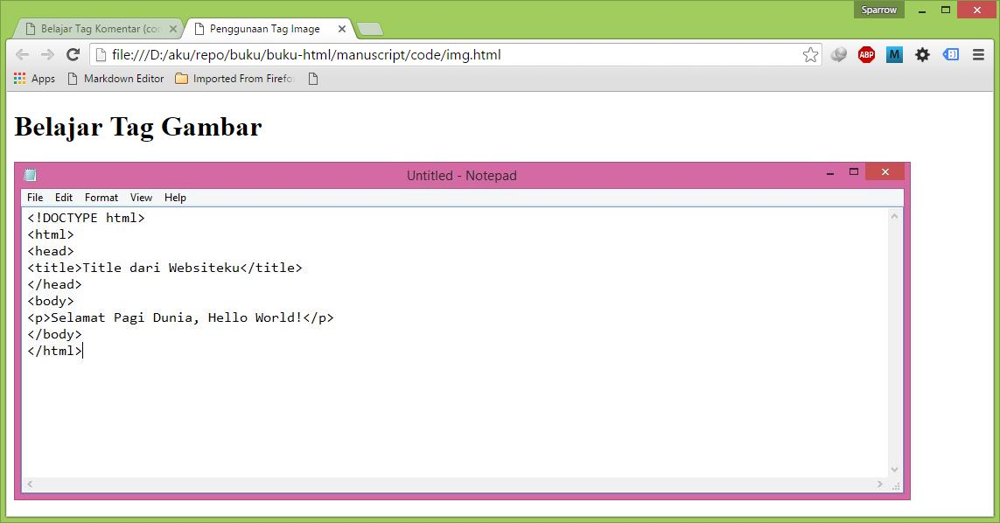

Perhatikan bahwa tag `` tidak memiliki elemen, sehingga
langsung ditutup dengan `/>`

### Cara Menambahkan Gambar di HTML

Hati-hati dengan penulisan atribut `src`, sering gambar gagal tampil
karena kita salah ketik atribut `src` menjadi "scr". Atribut alt dalam tag
`` Tag image juga memiliki atribut penting lainnya, yaitu `alt`

Atribut `alt` adalah singkatan dari "alternative description", dimana alt
digunakan untuk keterangan dari gambar jika gambar tersebut gagal
ditampilkan oleh browser. Atau jika web broser telah disetting untuk
tidak menampilkan gambar.

Contoh penggunaan atribut alt pada tag ``:

Atribut `alt` juga berperan penting untuk mesin pencari seperti Google.
Karena cara kerja google yang meng-index seluruh situs dengan memproses
tulisan yang ada, Google ‘tidak mengerti’ isi dari gambar tanpa bantuan
deskripsi yang ditulis dalam atribut `alt`. Hal ini menambah pentingnya
menambahkan atribut `alt`. Atribut `width` dan `height` dalam tag ``
Atribut lainnya membolehkan kita untuk menentukan besar dari gambar yang
ditampilkan, yaitu width dan height.

Contoh penggunaan atribut width dan height pada tag ``:

```html
<!DOCTYPE html>
<html>
<head>
<title>Penggunaan Tag Image</title>
</head>
<body>
<h1>Belajar Tag Gambar</h1>

</body>
</html>
```

### Cara Menambahkan Gambar di HTML Width


Pada penggunaan tag image diatas, gambar terlihat tidak proporsional,
hal ini karena penggunaan atribut width dan height ‘memaksa‘ gambar
untuk tampil dengan nilai yang kita tetapkan.

Untuk mempertahankan proporsi gambar, namun tetap membuat gambar menjadi
besar/kecil, cantumkan hanya salah satu atribut saja (width saja atau
height saja, namun tidak keduanya). Misalkan jika kita menetapkan
atribut `width=300px` (tanpa mencantumkan height), maka web browser akan
menampilkan gambar dengan lebar 300px, dan menghitung secara otomatis
tinggi gambar agar gambar tetap proporsional.

Biasanya web server akan menampilkan text terlebih dahulu, baru mengirim
gambar setelahnya. Untuk web server yang sibuk, atau gambar dengan
ukuran besar, hal ini akan menyebabkan text berpindah tempat karena
gambar yang terlambat ditampilkan. Mencantumkan ukuran dari gambar
dengan atribut width dan height akan memberikan kesempatan kepada
browser untuk mempersiapkan ukuran tersebut untuk gambar, dan text tidak
akan berpindah.

### Mengatur Tampilan Gambar dalam HTML (atribut align dan border)

Pada tutorial HTML dasar tentang gambar, kita telah mempelajari cara
memasukkan gambar ke dalam HTML. Dalam tutorial HTML lanjutan ini kita
akan membahas 2 buah atribut yang sering digunakan di dalam mengatur
tampilan gambar dalam HTML, yaitu atribut align dan atribut border.

Atribut align dan border yang akan kita bahas sebenarnya sudah berstatus
‘deprecated’, yakni tidak disarankan lagi untuk digunakan, dan mungkin
tidak akan didukung oleh web browser pada masa mendatang. Pengaturan
tampilan gambar sebaiknya menggunakan CSS. Namun sebagai bahan
informasi, saya akan tetap membahasnya pada tutorial kali ini.

#### Mengenal Atribut Align pada Tag ``

Secara default, gambar akan tampil dengan text berada di sisi bawah
gambar. Untuk mengubah atau mengatur tampilan gambar dalam HTML, kita
bisa menambahkan atribut align ke dalam tag ``. Atribut align
bisa diisi dengan beberapa nilai, yakni bottom, left, middle, right dan
top.

Sesuai dengan namanya, masing-masing nilai dari atribut align bisa
digunakan untuk mengatur tampilan gambar. Berikut adalah contoh kode
HTML dengan menggunakan atribut align="left" pada gambar.

```html
<!DOCTYPE html>
<html>
<head>
<title>Belajar HTML di turahe</title>
</head>
<body>
<h3 id="judul1">Saya sedang belajar HTML di turahe.github.io</h3>

<p>Turahe adalah situs porfolio milik Nur Wachid yang digunakan
untuk menjual kemampuan dari Seorang Wachid.

Saat ini Wachid masih menyediakan jasa pembuatan website baik menggunakan
html biasa atau menggunakan Framwok seperti Laravel.
</p>

</body>
</html>
```

Contoh Penulisan Atribut align dalam gambar HTML - tag img

Seperti yang
terlihat, bahwa dengan menambahkan atribut `align="left"`, gambar akan
berada di sisi kiri paragraf. Sebagai sarana latihan, anda bisa merubah
kode diatas dengan mengubah-ubah nilai dari atribut align.

#### Mengenal Atribut Border pada Tag ``

Atribut border digunakan untuk menambahkan garis tepi (border) kedalam
gambar. Nilai dari atribut ini adalah angka yang berisi ukuran lebar
garis tepi dalam satuan pixel. Berikut adalah contoh kode HTML dengan
menggunakan atribut border="5" pada gambar:

```html
<!DOCTYPE html>
<html>
<head>
<title>Belajar HTML di turahe</title>
</head>
<body>
<h3 id="judul1">Saya sedang belajar HTML di turahe.github.io</h3>

<p>turahe adalah situs Belajar Ilmu Komputer.

turahe didedikasikan bagi anda yang ingin mempelajari
tentang dunia ilmu komputer.
Saat ini turahe masih berfokus kepada tutorial web programming,
seperti Tutorial Belajar HTML, Tutorial CSS, Tutorial PHP,
Tutorial JavaScript, dan Tutorial MySQL.
</p>

</body>
</html>
```

Contoh Penulisan Atribut border dalam gambar HTML - tag img Penggunaan
atribut border secara langsung ke dalam tag `` memiliki banyak
keterbatasan, misalnya kita tidak bisa mengatur warna dan jenis border
dari gambar. Pengaturan yang lebih disarankan adalah dengan menggunakan
CSS.

## Membuat tabel di HTML (tag table)

Dalam menampilkan data yang terstruktur atau tampilan dari database,
kita biasanya akan membuatnya dalam bentuk tabel. HTML juga menyediakan
Tabel tag digunakan untuk menampilkan data dalam bentuk tabel. Dalam
tutorial belajar HTML cara membuat tabel HTML ini kita akan membahas
cara penggunaannya.

Cara Membuat Tabel HTML dengan tag `<table>`, `<tr>` dan
`<td>` Untuk membuat tabel di HTML, kita membutuhkan setidaknya 3
tag, yaitu tag `<tabel>`, tag `<tr>`, dan tag `<td>`:

-   Tag `<tabel>` digunakan untuk memulai tabel

-   Tag `<tr>` adalah singkatan dari table row, digunakan untuk
membuat baris dari tabel.

-   Tag `<td>` adalah singkatan dari table data, digunakan untuk
menginput data ke tabel.

Agar lebih jelas, kita akan langsung menggunakan contoh kode HTML:

Contoh penggunaan tag `<tabel>`:

```html
<!DOCTYPE html>
<html>
<head>
<title>Penggunaan Tag Tabel</title>
</head>
<body>
<h1>Belajar Tag Tabel</h1>
<table border="1">
<tr>
<td>Baris 1, Kolom 1</td>
<td>Baris 1, Kolom 2</td>
<td>Baris 1, Kolom 3</td>
</tr>
<tr>
<td>Baris 2, Kolom 1</td>
<td>Baris 2, Kolom 2</td>
<td> Baris 2, Kolom 3</td>
</tr>
<tr>
<td> Baris 3, Kolom 1</td>
<td> Baris 3, Kolom 2</td>
<td> Baris 3, Kolom 3</td>
</tr>
<tr>
<td> Baris 4, Kolom 1</td>
<td> Baris 4, Kolom 2</td>
<td> Baris 4, Kolom 3</td>
</tr>
</table>
</body>
</html>
```

Cara Membuat tabel di HTML (tag table)

Perhatikan bahwa pada tag `<tabel>` kita memberikan atribut border.
Atribut border digunakan untuk memberikan nilai garis tepi dari tabel.
Nilai ini dalam ukuran pixel. border="1", berarti kita mengistruksikan
kepada web browser bahwa tabel tersebut akan memiliki garis tepi sebesar
1 pixel. Jika tidak ditambahkan, secara default tabel tidak memiliki
garis tepi.

Sebelum standar CSS diimplementasikan ke dalam semua browser, pada
sekitar tahun 2000-an kebanyakan programmer dan desainer web menggunakan
tabel untuk mengatur tampilan web. Membuat menu ada di atas dan sisi
kanan web bisa diakali dengan menjadikan halaman web sebagai sebuah
tabel yang besar. Hal ini sebenarnya tidak salah, namun akan membuat
pengkodean HTML menjadi rumit. Saat ini anda masih bisa menggunakan ide
tersebut, namun sangat disarankan menggunakan CSS untuk mengatur
tampilan halaman web.

Dalam penggunaannya, HTML masih memiliki banyak tag dan atribut yang
dapat digunakan untuk membuat tabel yang lebih kompleks, seperti atribut
cellpadding, cellspacing, tag thead, tag tbody, dan lain-lain.

Diharapkan dengan Tutorial HTML Lanjutan: Tag dan Atribut untuk
Pembuatan Tabel HTML ini, anda dapat menguasai bagaimana cara
perancangan tabel di dalam HTML.

Berikut adalah index Tutorial Pembuatan Tabel HTML:

1.  Mengenal atribut border, cellpadding dan cellspacing dalam Tabel
2.  Menggabungkan Sel Tabel (atribut rowspan dan colspan)
3.  Membuat Judul Kolom Header Tabel HTML (tag th)
4.  Membuat Judul Tabel HTML (tag caption)
5.  Membuat Struktur Tabel HTML (tag thead, tfoot dan tbody)
6.  Membuat Group Kolom Tabel (tag colgroup dan tag col)
7.  Membuat Garis Antara Baris dan Kolom Tabel (atribut rules)
8.  Mengatur dan Mengubah Lebar Tabel HTML (atribut width)
9.  Mengatur dan Mengubah Tinggi Tabel HTML (atribut height)

### Atribut border dalam tabel HTML

Atribut border digunakan untuk mengatur ketebalan dari garis tepi
(border) dari tabel. Jika atribut ini tidak ditulis, maka web browser
akan menampilkan tabel tanpa garis tepi.

Nilai dari atribut ini berupa angka yang diukur dalam satuan pixel. Jika
anda memberikan nilai border="2", maka web browser akan menampilkan
garis tepi sebesar 2 pixel pada sisi atas, bawah, kiri dan kanan tabel.

Berikut adalah contoh penggunaan atribut border dalam tag table HTML:

```html
<!DOCTYPE html>
<html>
<head>
<title>Penggunaan atribut border dalam Tabel</title>
</head>
<body>
<h3>Belajar atribut border dalam Tabel</h3>
<table border="0">
<tr>
<td>Baris 1, Kolom 1</td>
<td>Baris 1, Kolom 2</td>
<td>Baris 1, Kolom 3</td>
</tr>
<tr>
<td>Baris 2, Kolom 1</td>
<td>Baris 2, Kolom 2</td>
<td>Baris 2, Kolom 3</td>
</tr>
</table>
<br />

<table border="6">
<tr>
<td>Baris 1, Kolom 1</td>
<td>Baris 1, Kolom 2</td>
<td>Baris 1, Kolom 3</td>
</tr>
<tr>
<td>Baris 2, Kolom 1</td>
<td>Baris 2, Kolom 2</td>
<td>Baris 2, Kolom 3</td>
</tr>
</table>
</body>
</html>
```


Dengan memberikan nilai ‘0’ kepada atribut border, tabel seolah-olah
tidak memiliki garis tepi.

Perhatikan bahwa jika anda mengubah border="1" menjadi border="5"
misalnya, maka garis border yang terkena efek hanya border pada sisi
luar tabel, namun tidak untuk garis border di dalam tabel.

### Atribut cellpadding dalam tabel HTML

Atribut cellpadding digunakan untuk mengatur jarak dari border sisi
dalam tabel dengan isi text tabel itu sendiri.

Nilai dari atribut ini berupa angka yang diukur dalam satuan pixel. Jika
anda memberikan nilai cellpadding="2", maka web browser akan membuat
jarak sebesar 2 pixel dari border sisi dalam tabel dengan isi text
tabel.

Berikut contoh penggunaan atribut cellpadding dalam tag table HTML:

```html
<!DOCTYPE html>
<html>
<head>
<title>Penggunaan atribut cellpadding dalam Tabel</title>
</head>
<body>
<h3>Belajar atribut cellpadding dalam Tabel</h3>
<table border="1" cellpadding="0">
<tr>
<td>Baris 1, Kolom 1</td>
<td>Baris 1, Kolom 2</td>
<td>Baris 1, Kolom 3</td>
</tr>
<tr>
<td>Baris 2, Kolom 1</td>
<td>Baris 2, Kolom 2</td>
<td>Baris 2, Kolom 3</td>
</tr>
</table>
<br />

<table border="1" cellpadding="7">
<tr>
<td>Baris 1, Kolom 1</td>
<td>Baris 1, Kolom 2</td>
<td>Baris 1, Kolom 3</td>
</tr>
<tr>
<td>Baris 2, Kolom 1</td>
<td>Baris 2, Kolom 2</td>
<td>Baris 2, Kolom 3</td>
</tr>
</table>
</body>
</html>
```

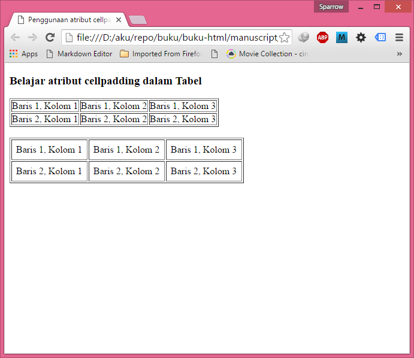

Pengaturan cellpadding yang tepat akan membuat isi text tabel menjadi
lebih rapi dan mudah dibaca.

### Atribut cellspacing dalam tabel HTML

Atribut cellspacing digunakan untuk mengatur jarak antara garis tepi
(border) bagian dalam dan luar.

Nilai dari atribut ini berupa angka yang diukur dalam satuan pixel. Jika
anda memberikan nilai cellspacing="2", maka web browser akan menampilkan
jarak sebesar 2 pixel diantara garis border tabel.

Berikut contoh penggunaan atribut cellspacing dalam tag table HTML:

```html
<!DOCTYPE html>
<html>
<head>
<title>Penggunaan atribut cellspacing dalam Tabel</title>
</head>
<body>
<h3>Belajar atribut cellspacing dalam Tabel</h3>
<table border="1" cellspacing="0">
<tr>
<td>Baris 1, Kolom 1</td>
<td>Baris 1, Kolom 2</td>
<td>Baris 1, Kolom 3</td>
</tr>
<tr>
<td>Baris 2, Kolom 1</td>
<td>Baris 2, Kolom 2</td>
<td>Baris 2, Kolom 3</td>
</tr>
</table>
<br />

<table border="1" cellspacing="7">
<tr>
<td>Baris 1, Kolom 1</td>
<td>Baris 1, Kolom 2</td>
<td>Baris 1, Kolom 3</td>
</tr>
<tr>
<td>Baris 2, Kolom 1</td>
<td>Baris 2, Kolom 2</td>
<td>Baris 2, Kolom 3</td>
</tr>
</table>
</body>
</html>
```


Menggabungkan ketiga atribut tersebut dalam sebuah tabel, maka kita
dapat menyesuaikan tampilan tabel sesuai dengan keinginan kita.

Untuk tampilan tabel, kadang kita butuh membuat tabel dengan jumlah
kolom yang berbeda antara baris pertama dan baris lainnya, atau
menggabungkan sebuah sel tabel dengan sel lainnya. Untuk keperluan ini,
HTML menyediakan atribut rowspan dan colspan. Dalam tutorial cara
menggabungkan sel Tabel HTML ini, kita akan mempelajari cara
penggunaannya.

### Atribut Rowspan and Colspan

Atribut rowspan and colspan digunakan untuk membuat sel tabel ‘bersatu’
dengan sel yang lain. Atribut ini diletakkan pada tag td dari sebuah
tabel. Agar mudah memahami, langsung saja kita buat contoh kode HTMLnya.

Buka aplikasi text editor, ketikkan kode berikut, dan save sebagai
tabelspan.html

Contoh penggunaan atribut rowspan and colspan:

```html
<!DOCTYPE html>
<html>
<head>
<title>Contoh Penggunaan Atribut Colspan dan Rowspan Tag Tabel</title>
</head>
<body>
<h1>Contoh atribut colspan dan rowspan </h1>
<table border="1">
<tr>
<td>Baris 1, Kolom 1</td>
<td>Baris 1, Kolom 2</td>
<td>Baris 1, Kolom 3</td>
</tr>
<tr>
<td>Baris 2, Kolom 1</td>
<td colspan="2" >Baris 2, Kolom 2 & 3</td>
</tr>
<tr>
<td rowspan="2"> Baris 3 & 4, Kolom 1</td>
<td> Baris 3, Kolom 2</td>
<td> Baris 3, Kolom 3</td>
</tr>
<tr>
<td> Baris 4, Kolom 2</td>
<td> Baris 4, Kolom 3</td>
</tr>
</table>
</body>
</html>
```

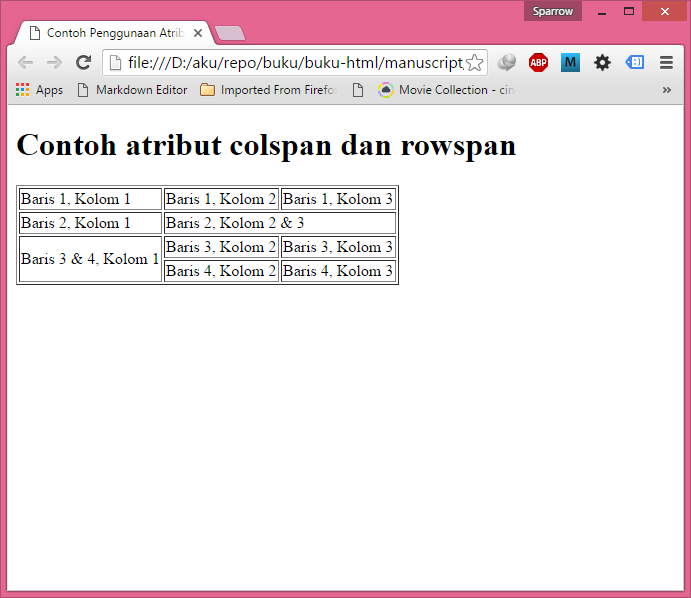

Dalam contoh diatas, kita dapat melihat bahwa tag td yang memiliki
atribut colspan, akan membuat sel tabel bersatu dengan kolom
disebelahnya. Sedangkan atribut rowspan akan membuat sel tabel bersatu
dengan baris dibawahnya. Kedua atribut ini membutuhkan nilai (value),
dimana nilai ini adalah seberapa banyak sel tabel yang dibuat ‘bersatu’.

Misalkan colspan=’3’ akan membuat 3 kolom bergabung menjadi 1 sel, dan
rowspan=’2’ akan membuat sel tabel bersatu dengan 1 baris dibawahnya.

Contoh Penggunaan Atribut Colspan dan Rowspan Tag Tabel

Dalam membuat tabel dengan atribut rowspan dan clospan, anda sebaiknya
telah mengkalkulasi seberapa besar tabel yang akan dibuat, karena dengan
semakin kompleks tabel, akan semakin rumit untuk menggabungkan beberapa
sel tabel tersebut.

### Fungsi Tag th

Sering kali dalam membuat tabel, baris pertama kita gunakan sebagai
judul kolom dari baris-baris dibawahnya. Dan biasanya baris pertama
tabel ini secara visual dibedakan dengan baris dibawahnya agar tampak
lebih menarik, misalnya diberi warna yang berbeda, atau font yang
berbeda.

Untuk keperluan ini, HTML memiliki tag khusus yang bisa digunakan, yaitu
tag th (singkatan dari table head) . Dalam penggunaan tag th, kita hanya
perlu mengganti tag td dengan th pada baris pertama tabel.

Sebagai contoh cara penggunaan tag th, silahkan buka aplikasi text
editor, ketikkan kode berikut, dan save sebagai tabelth.html

Contoh penggunaan tag th:

```html
<!DOCTYPE html>
<html>
<head>
<title>Cara Penulisan Tag th dalam Tabel HTML</title>
</head>
<body>
<h2>Belajar Tag th untuk Tabel HTML</h2>
<table border="1">
<tr>
<th>Judul 1</th>
<th>Judul 2</th>
<th>Judul 3</th>
</tr>
<tr>
<td>Baris 1, Kolom 1</td>
<td>Baris 1, Kolom 2</td>
<td>Baris 1, Kolom 3</td>
</tr>
<tr>
<td>Baris 2, Kolom 1</td>
<td>Baris 2, Kolom 2</td>
<td>Baris 2, Kolom 3</td>
</tr>
</table>
</body>
</html>
```

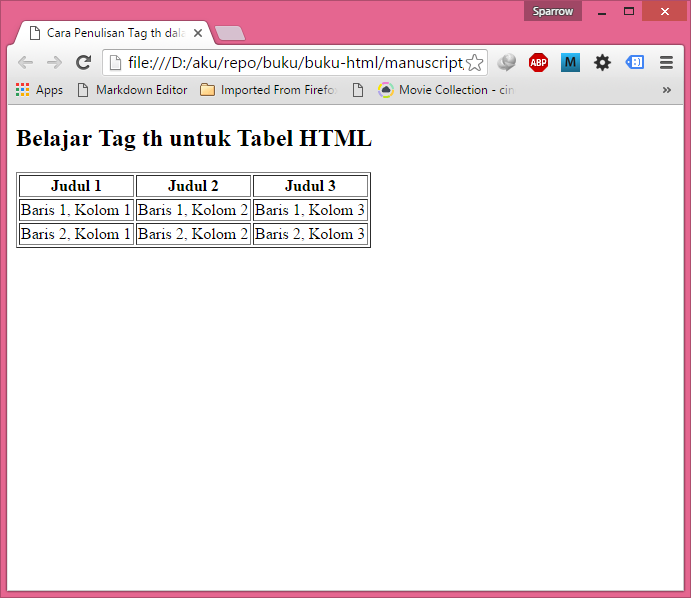

Perhatikan pada baris
pertama tabel, dimana dalam tutorial tentang tabel HTML sebelumnya,
semua sel dari tabel ditulis menggunnakan tag td. Namun, kali ini tag td
kita ganti menjadi tag th.

Tag th secara default akan ditampilkan sedikit berbeda pada beberapa web
browser. Pada mozilla firefox yang saya gunakan, tag th ditampilkan
dengan huruf tebal dan berada di tengah-tengah kolom.

> Dengan menggunakan atribut style ataupun dengan CSS, kita dapat
> merubah tampilan huruf pada tag td biasa menjadi tag th tersebut. Tag
> th lebih diperuntukkan untuk memberikan struktur pada tabel. Sedapat
> mungkin kita menggunakan HTML hanya untuk stuktur, mengenai tampilan
> sebaiknya menggunakan CSS.

### Tag caption

Tag caption berfungsi untuk membuat judul tabel di dalam HTML. Tag ini
agak jarang digunakan, namun sebenarnya sangat bermanfaat. Dengan
mempelajari tag caption ini, kita mengetahui bahwa HTML telah
menyediakan tag khusus untuk membuat judul tabel.

Tag caption digunakan untuk membuat judul maupun memberikan keterangan
untuk sebuah tabel HTML. Penulisan tag caption harus ditulis setelah tag
pembuka tabel (setelah tag table).

Kita langsung saja ke contoh penggunaan tag caption ini. Silahkan buka
aplikasi text editor, ketikkan kode berikut, dan savelah sebagai
tabelcaption.html

Contoh penggunaan tag caption:

```html
<!DOCTYPE html>
<html>
<head>
<title>Cara Penulisan Tag Caption Tabel HTML</title>
</head>
<body>
<h2>Belajar Tag caption untuk Tabel HTML</h2>
<table border="1">
<caption>Contoh Caption Tabel</caption>
<tr>
<th>Judul 1</th>
<th>Judul 2</th>
<th>Judul 3</th>
</tr>
<tr>
<td>Baris 1, Kolom 1</td>
<td>Baris 1, Kolom 2</td>
<td>Baris 1, Kolom 3</td>
</tr>
<tr>
<td>Baris 2, Kolom 1</td>
<td>Baris 2, Kolom 2</td>
<td>Baris 2, Kolom 3</td>
</tr>
</table>
</body>
</html>
```

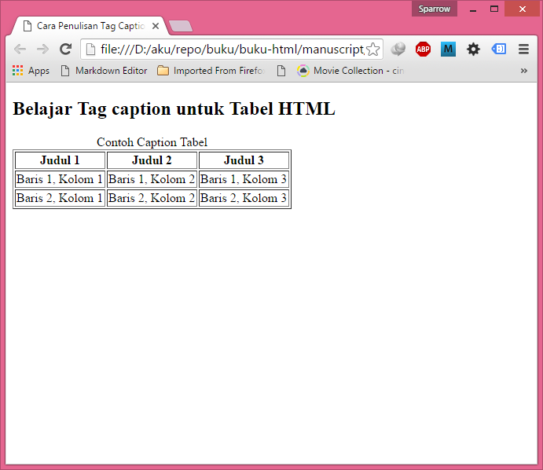

Ketika dijalankan pada web
browser, tag caption tersebut akan ditampilkan sebelum tabel, sehingga
cocok untuk membuat keterangan dari tabel.

Selain menggunakan tag caption, banyak web developer menggunakan tag
header untuk judul dari kolom, seperti tag h3 atau h4 karena bisa
meningkatkan nilai judul tabel di dalam search engine (Search Engine
Optimization). Namun setidaknya kita mengetahui bahwa HTML menyediakan
tag caption ini sebagai fitur dalam membuat tabel HTML agar tampak lebih
informatif.

### Struktur Tabel HTML (tag thead, tfoot dan tbody)

Untuk tabel yang lebih kompleks, HTML menyediakan tag-tag yang dapat
digunakan untuk ‘membagi’ tabel menjadi bagian-bagian yang terpisah,
misalnya bagian judul (head), bagian penutup (foot), dan bagian isi
tabel (body). Untuk keperluan tersebut, pada tutorial tabel HTML kali
ini kita akan mempelajari Cara Membuat Struktur Tabel HTML dengan tag
thead, tfoot dan tbody.

Seperti yang telah kita pelajari dalam tutorial tentang pembuatan tabel,
sebuah tabel dapat dirancang dengan menggunakan 3 tag saja, yaitu tag
table, tag tr, dan tag td. Namun jika kita membutuhkan pembagian
struktur tabel HTML yang lebih jelas, HTML menyediakan tag khusus untuk
keperluan ini, terdiri dari tag thead, tfoot dan tbody.

Untuk lebih memahami maksud dan cara penggunaan tag thead, tfoot dan
tbody, langsung saja kita tampilkan kode HTMLnya. Silahkan buka aplikasi
text editor, lalu ketikkan kode berikut, dan save sebagai
tabelstruktur.html.

Contoh penggunaan tag thead, tfoot dan tbody:

```html
<!DOCTYPE html>
<html>
<head>
<title>Penggunaan Tag thead, tfoot dan tbody dalam Tabel</title>
</head>
<body>
<h3>Belajar Tag thead, tfoot dan tbody dalam Tabel</h3>
<table border="1">
<thead>
<tr>
<th>Judul 1</th>
<th>Judul 2</th>
<th>Judul 3</th>
</tr>
</thead>
<tfoot>
<tr>
<td>Footer 1</td>
<td>Footer 2</td>
<td>Footer 3</td>
</tr>
</tfoot>
<tbody>
<tr>
<td>Baris 1, Kolom 1</td>
<td>Baris 1, Kolom 2</td>
<td>Baris 1, Kolom 3</td>
</tr>
<tr>
<td>Baris 2, Kolom 1</td>
<td>Baris 2, Kolom 2</td>
<td>Baris 2, Kolom 3</td>
</tr>
</tbody>
</table>
</body>
</html>
```

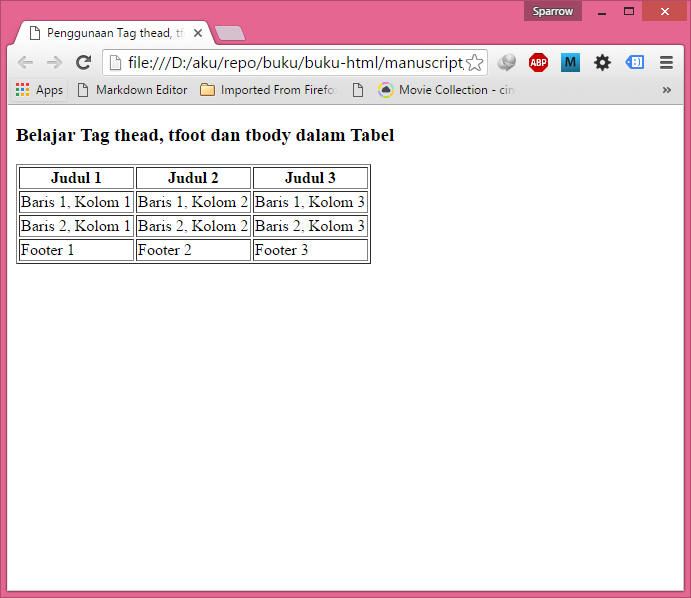

Kode
HTML diatas terasa sedikit panjang untuk membuat sebuah tabel bila
dibandingkan sewaktu membuat tabel sederhana dalam tutorial Cara Membuat
tabel di HTML (tag table).

Kembali kedalam kode HTML diatas, perhatikan tag pembuka dan penutup
untuk setiap tag tr dalam tabel. Terlihat bahwa kita menggunakan 3 tag
baru, yakni tag thead, tfoot dan tbody (singkatan dari table header,
table foot, dan table body). Ketiga tag tersebut digunakan untuk membagi
struktur tabel menjadi 3 bagian.

Perhatikan pula urutan penulisan tabel diatas. Dapat dilihat bahwa untuk
tag tfoot, walaupun dibuat persis setelah thead pada awal tabel, namun
web browser akan menampilkannya pada baris terakhir dari tabel.

Tag `thead`, `tfoot` dan `tbody` mungkin tidak akan sering dipakai, terutama
untuk membuat tabel sederhana dengan jumlah baris kurang dari 10. Namun
untuk tabel yang kompleks, struktur HTML seperti ini akan memudahkan
dalam ‘mengatur’ tampilan tabel, terutama jika menggunakan kode CSS
nantinya.

### Membuat Group Kolom Tabel (tag colgroup dan tag col)

Seperti yang telah kita bahas pada artikel tutorial tabel HTML
sebelumnya, maka jika anda perhatikan bahwa sebuah tabel di dalam HTML
dibuat secara baris per baris dengan menyusun beberapa tag td di dalam
tag tr. Pola penyusunan seperti ini akan terasa menyulitkan jika kita
ingin merubah atribut yang berlaku untuk seluruh kolom, terutama jika
menggunakan CSS.

Jika sebelumnya anda telah mempelajari CSS, untuk memanipulasi sebuah
baris, kita hanya perlu membuat atribut class atau style pada tag tr,
dan seluruh baris tersebut akan berubah, namun tidak sebaliknya jika
kita ingin membuat seluruh kolom berubah. Contoh kasusnya, misalkan kita
ingin merubah warna background pada seluruh kolom pertama dan ketiga
dari tabel.

Untuk keperluan ini, HTML memiliki tag colgroup dan tag col yang
berfungsi untuk ‘mengaitkan’ keseluruhan kolom. Tanpa tag ini kita harus
mengakses satu per satu sel tabel.

Sebagai contoh penggunaan tag ini, silahkan buka aplikasi text editor,
lalu ketikkan kode berikut, dan save sebagai tabelcol.html

Contoh penggunaan tag colgroup dan tag col :

```html
<!DOCTYPE html>
<html>
<head>
<title>Penggunaan tag colgroup dan col dalam Tabel</title>
</head>
<body>
<h3>Belajar Tag colgroup dan col dalam Tabel</h3>
<table border="1">
<colgroup>
<col style="background-color:yellow" />
<col style="background-color:green" />
<col />
</colgroup>
<tr>
<th>Judul 1</th>
<th>Judul 2</th>
<th>Judul 3</th>
</tr>
<tr>
<td>Baris 1, Kolom 1</td>
<td>Baris 1, Kolom 2</td>
<td>Baris 1, Kolom 3</td>
</tr>
<tr style="color:blue">
<td>Baris 2, Kolom 1</td>
<td>Baris 2, Kolom 2</td>
<td>Baris 2, Kolom 3</td>
</tr>
</table>
</body>
</html>
```


Untuk contoh diatas, saya menggunakan tag style untuk ‘memasukkan’ kode
CSS. Lebih jauh tentang CSS, silahkan mempelajarinya pada Tutorial
Belajar CSS.

Di dalam kode HTML tersebut, tag colgroup dan tag col dibuat pada baris
pertama sebelum tag tr tabel. Setiap tag col harus disesuaikan dengan
jumlah kolom dari tabel. Dengan merubah style pada tag col, efeknya
seluruh sel tabel pada kolom tersebut juga akan berubah. Untuk baris,
hal yang sama dapat kita lakukan dengan merubah atribut dari tag tr.

#### Penggunaan atribut width pada tag col

Salah satu atribut yang bisa kita gunakan pada tag col adalah atribut
width. Atribut ini digunakan untuk mengatur lebar dari masing-masing
kolom dalam tabel.

Buka aplikasi text editor, ketikkan kode berikut, dan save sebagai
tabelcolwidth.html

Contoh penggunaan atribut width pada tag col :

```html
<!DOCTYPE html>
<html>
<head>
<title>Belajar atribut width dalam Tabel</title>
</head>
<body>
<h3>Belajar atribut width dalam Tabel</h3>
<table border="1">
<colgroup>
<col width="75px" style="background-color:blue" />
<col width="150px" />
<col width="300px" />
<col />
</colgroup>
<tr>
<th>Judul 1</th>
<th>Judul 2</th>
<th>Judul 3</th>
</tr>
<tr>
<td>Baris 1, Kolom 1</td>
<td>Baris 1, Kolom 2</td>
<td>Baris 1, Kolom 3</td>
</tr>
<tr>
<td>Baris 2, Kolom 1</td>
<td>Baris 2, Kolom 2</td>
<td>Baris 2, Kolom 3</td>
</tr>
</table>
</body>
</html>
```

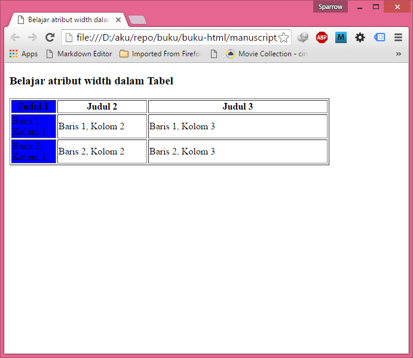

Dari contoh kode HTML diatas, saya
menggunakan atribut width untuk mengatur lebar dari kolom tabel.
Misalnya untuk kolom pertama, atribut width="75px" digunakan untuk
membuat lebar kolom menjadi 75 pixel. Lebih lanjut tentang atribut
width, akan saya bahas secara tersendiri pada tutorial selanjutnya.

## Garis Antara Baris dan Kolom Tabel (atribut rules)

Pada tutorial kali ini kita akan membahas tentang atribut rules. Atribut
ini dapat digunakan untuk membuat dan mengubah garis pembatas antar sel
(baris dan kolom) di dalam tabel HTML.

Karena atribut ini sangat berkaitan dengan tampilan untuk memperindah
tabel, disarankan menggunakan CSS sebagai ganti atribut rules ini jika
anda telah memahami CSS.

Jika sebelumnya anda telah mempelajari pembahasan tentang atribut border
untuk tabel, maka jika diperhatikan, web browser sebenarnya tidak hanya
menampilkan border, namun juga garis pembatas di antara sel tersebut,
seperti tampilan dibawah ini:

HTML menyediakan sebuah atribut yang dapat digunakan untuk mengontrol
garis pembatas antara baris dan kolom ini, yakni atribut rules.
Penulisan atribut rules di letakkan pada tag table. Atribut rules dapat
berisi 1 diantara 4 nilai: `rows`, `cols`, `all`, atau `none`.

Sesuai dengan arti dari masing-masing nilai tersebut, jika kita
menambahkan atribut rules="cols" pada tabel, maka untuk setiap sel akan
ditampilkan garis pembatas hanya diantara kolom. Sedangkan atribut
rules="rows" akan menampilkan garis pembatas hanya diantara baris.

Jika menginginkan garis tampil baik untuk kolom maupun untuk baris
tabel, kita dapat menggunakan atribut `rules="all"`. Sebaliknya jika tidak
ingin menampilkan garis apapun diantara sel, bisa menggunakan atribut
`rules="none"`.

Berikut adalah contoh dari kode HTML yang menggunakan atribut rules,
savelah sebagai tabelrules.html

```html
<!DOCTYPE html>
<html>
<head>
<title>Contoh pemakaian attribut rules dalam Tabel HTML</title>
</head>
<body>
<h2>Belajar atribut rules dalam Tabel HTML</h2>

<h4>rules = "rows"</h4>
<table rules="rows">
<tr>
<th>Judul 1</th>
<th>Judul 2</th>
<th>Judul 3</th>
</tr>
<tr>
<td>Baris 1, Kolom 1</td>
<td>Baris 1, Kolom 2</td>
<td>Baris 1, Kolom 3</td>
</tr>
<tr>
<td>Baris 2, Kolom 1</td>
<td>Baris 2, Kolom 2</td>
<td>Baris 2, Kolom 3</td>
</tr>
<tr>
<td>Baris 3, Kolom 1</td>
<td>Baris 3, Kolom 2</td>
<td>Baris 3, Kolom 3</td>
</tr>
</table>

<h4>rules = "cols"</h4>
<table rules="cols">
<tr>
<th>Judul 1</th>
<th>Judul 2</th>
<th>Judul 3</th>
</tr>
<tr>
<td>Baris 1, Kolom 1</td>
<td>Baris 1, Kolom 2</td>
<td>Baris 1, Kolom 3</td>
</tr>
<tr>
<td>Baris 2, Kolom 1</td>
<td>Baris 2, Kolom 2</td>
<td>Baris 2, Kolom 3</td>
</tr>
<tr>
<td>Baris 3, Kolom 1</td>
<td>Baris 3, Kolom 2</td>
<td>Baris 3, Kolom 3</td>
</tr>
</table>

<h4>rules = "all"</h4>
<table rules="all"> 
<tr>
<th>Judul 1</th>
<th>Judul 2</th>
<th>Judul 3</th>
</tr>
<tr>
<td>Baris 1, Kolom 1</td>
<td>Baris 1, Kolom 2</td>
<td>Baris 1, Kolom 3</td>
</tr>
<tr>
<td>Baris 2, Kolom 1</td>
<td>Baris 2, Kolom 2</td>
<td>Baris 2, Kolom 3</td>
</tr>
<tr>
<td>Baris 3, Kolom 1</td>
<td>Baris 3, Kolom 2</td>
<td>Baris 3, Kolom 3</td>
</tr>
</table>

<h4>rules="none", border="1"</h4>
<table rules="none" border="1" >

<tr>
<th>Judul 1</th>
<th>Judul 2</th>
<th>Judul 3</th>
</tr>
<tr>
<td>Baris 1, Kolom 1</td>
<td>Baris 1, Kolom 2</td>
<td>Baris 1, Kolom 3</td>
</tr>
<tr>
<td>Baris 2, Kolom 1</td>
<td>Baris 2, Kolom 2</td>
<td>Baris 2, Kolom 3</td>
</tr>
<tr>
<td>Baris 3, Kolom 1</td>
<td>Baris 3, Kolom 2</td>
<td>Baris 3, Kolom 3</td>
</tr>
</table>

</body>
</html>
```

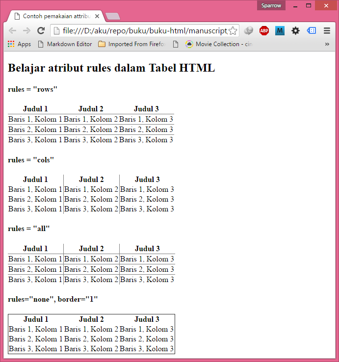

Dari hasil kode HTML
diatas, terlihat perbedaan untuk masing-masing nilai rules. Anda bisa
menggabungkan berbagai atribut lainnya seperti border, cellspacing, dan
lain-lain untuk menghasilkan tabel sesuai dengan keinginan.

### Mengatur dan Mengubah Lebar Tabel HTML (atribut width)

ecara default bawaan HTML, setiap tabel akan diatur lebarnya secara
otomatis dari besar data yang ada didalam tabel tersebut, namun jika
kita ingin ‘memaksakan’ web browser untuk menampilkan tabel dengan lebar
tertentu, kita bisa menambahkan sebuah atribut width untuk mengatur
lebar tabel.

Sama seperti penjelasan pada tutorial tentang rules, jika anda telah
memahami CSS, disarankan menggunakan CSS untuk memanipulasi tampilan
dari tabel dibandingkan menggunakan atribut width secara langsung
didalam tag HTML.

Berikut adalah contoh tabel yang memiliki perbedaan panjang untuk baris:

```html
<!DOCTYPE html>
<html>
<head>
<title>Contoh pemakaian attribut width dalam Tabel HTML</title>
</head>
<body>
<h2>Belajar atribut width dalam Tabel HTML</h2>
<table border="1">
<caption>Tabel Tanpa Atribut Width</caption>
<tr>
<th>Judul 1</th>
<th>Judul 2</th>
<th>Judul 3</th>
</tr>
<tr>
<td>Baris 1, Kolom 1</td>
<td>Baris 1, Kolom 2</td>
<td>Baris 1, Kolom 3</td>
</tr>
<tr>
<td>Data yang sangat panjang, 
sehingga merusak tampilan dari tabel</td>
<td>Baris 2, Kolom 2</td>
<td>Baris 2, Kolom 3</td>
</tr>
<tr>
<td>Baris 3, Kolom 1</td>
<td>Baris 3, Kolom 2</td>
<td>Baris 3, Kolom 3</td>
</tr>
</table>
</body>
</html>
```


Dapat dilihat bahwa web browser menampilkan tabel sesuai dengan panjang
data yang terdapat pada baris terpanjang, dan jika anda mencoba
mengecilkan jendela web browser, tampilan tabel akan bergeser
menyesuaikan dengan lebar web browser. Inilah tampilan default dari
tabel HTML.

#### Mengatur Lebar Tabel Dengan Atribut Width

Atribut width dapat digunakan untuk tag tabel (tag table) maupun untuk
tag kolom (tag th, tag td, maupun tag col). Jika diletakkan pada tag
table, atribut ini berfungsi untuk mengatur lebar tabel secara
keseluruhan. Namun jika diletakkan pada tag th atau td, atribut ini akan
berfungsi untuk mengatur lebar kolom.

Untuk "memaksa" web browser menampilkan lebar tabel sesuai dengan yang
diinginkan, kita dapat menambahkan atribut width pada tag table, seperti
contoh berikut:

Contoh penggunaan atribut width tabel HTML, tabelwidth.html

```html
<!DOCTYPE html>
<html>
<head>
<title>Contoh pemakaian attribut width dalam Tabel HTML</title>
</head>
<body>
<h2>Belajar atribut width dalam Tabel HTML</h2>
<table border="1" width="600px">
<caption>------------Lebar Tabel 600px--------------</caption>
<tr>
<th>Judul 1</th>
<th>Judul 2</th>
<th>Judul 3</th>
</tr>
<tr>
<td>Baris 1, Kolom 1</td>
<td>Baris 1, Kolom 2</td>
<td>Baris 1, Kolom 3</td>
</tr>
<tr>
<td>Data yang sangat panjang, 
sehingga merusak tampilan dari tabel</td>
<td>Baris 2, Kolom 2</td>
<td>Baris 2, Kolom 3</td>
</tr>
<tr>
<td>Baris 3, Kolom 1</td>
<td>Baris 3, Kolom 2</td>
<td>Baris 3, Kolom 3</td>
</tr>
</table>
</body>
</html>
```

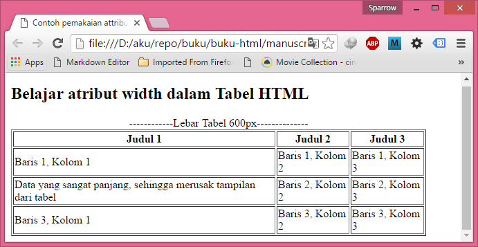

Jika anda mencoba mengubah kembali ukuran web browser, tampilan tabel
akan tetap, sesuai dengan nilai dari atribut width.

Atribut width dapat berisi nilai fixed (tetap), yakni dalam satuan pixel
(misalnya: 400px, 600px), maupun nilai relatif dalam bentuk persen
(misalnya: 30%, 60%).

Jika kita menggunakan nilai relatif seperti 50%, maka lebar tabel akan
ditampilkan sebesar 50% dari tag induk (tag parent) dari tab tabel.
Sepanjang contoh kita disini, tag parent dari tag table adalah tag body.
Namun untuk tag body ini, kita tidak merubah nilai widthnya, dan secara
default mencakup seluruh lebar web browser. Sehingga jika sebuah tabel
memiliki lebar 50%, maka ukurannya adalah 50% dari layar web browser.

#### Mengatur Lebar Kolom Dengan Atribut Width

Pada contoh tabelwidth.html diatas, walaupun kita telah mengatur lebar
dari tabel, namun lebar masing-masing kolom akan 'dibagi' secara
proporsional oleh web browser. Untuk mengatur lebar kolom tabel secara
individu, maka atribut width harus diletakkan pada tag kolom (tag th,
td, maupun tag col).

Namun syarat agar kita bisa mengatur lebar masing-masing kolom, lebar
tabel juga telah ditentukan terlebih dahulu melalui atribut width pada
tag table.

Berikut adalah contoh tabel yang menggunakan atribut width pada tag th.

```html
<!DOCTYPE html>
<html>
<head>
<title>Contoh pemakaian attribut width dalam Tabel HTML</title>
</head>
<body>
<h2>Belajar atribut width dalam Tabel HTML</h2>
<table border="1" width="600px">
<caption>Lebar Tabel 600px</caption>
<tr>
<th width="300px">Judul 1 (width=300px)</th>
<th width="200px">Judul 2 (width=200px)</th>
<th width="100px">Judul 3 (width=100px)</th>
</tr>
<tr>
<td>Baris 1, Kolom 1</td>
<td>Baris 1, Kolom 2</td>
<td>Baris 1, Kolom 3</td>
</tr>
<tr>
<td>Data yang sangat panjang, 
sehingga merusak tampilan dari tabel</td>
<td>Baris 2, Kolom 2</td>
<td>Baris 2, Kolom 3</td>
</tr>
<tr>
<td>Baris 3, Kolom 1</td>
<td>Baris 3, Kolom 2</td>
<td>Baris 3, Kolom 3</td>
</tr>
</table>
</body>
</html>
```

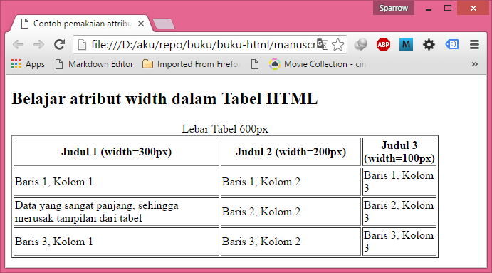

Seperti yang terlihat, bahwa lebar dari masing-masing kolom diset
melalui nilai atribut width.

Sebagai catatan, seandainya total lebar dari seluruh kolom (atribut
width pada tag th) melebihi lebar tabel (atribut width pada tag table),
maka lebar masing-masing kolom akan 'disesuaikan' agar tidak melebihi
lebar tabel. Sehingga untuk menghindari tampilan yang tidak diinginkan,
pastikan agar total lebar kolom tidak melebihi nilai width tabel.

## Mengatur dan Mengubah Tinggi Tabel HTML (atribut height)

Untuk keperluan yang lebih khusus, tinggi default tabel HTML dirasa
tidak mencukupi, untuk hal ini HTML menyediakan atribut height untuk
mengatur tinggi tabel, dan juga mengatur tinggi masing-masing baris.

Jika anda sudah mengenal CSS, disarankan menggunakan CSS untuk
menggantikan penggunaan atribut height ini. Fungsi atribut height Sama
seperti atribut width, atribut height dapat digunakan di dalam tag table
atau tag `tr`.

Jika digunakan di dalam tag table, maka nilai dari width akan dibagi
secara merata kedalam seluruh baris. Namun jika kita menginginkan
merubah tinggi baris tabel secara individu, tag width harus diletakkan
pada setiap tag `tr`.

Berikut contoh penggunaan atribut height pada tag table:

```html
<!DOCTYPE html>
<html>
<head>
<title>Contoh pemakaian attribut height dalam Tabel HTML</title>
</head>
<body>
<h2>Belajar atribut height dalam Tabel HTML</h2>
<h3>Atribut height pada tag table</h3>
<table height="200px" border="1">
<caption>Tinggi Tabel 200px</caption>
<tr>
<th>Judul 1</th>
<th>Judul 2</th>
<th>Judul 3</th>
</tr>
<tr>
<td>Baris 1, Kolom 1</td>
<td>Baris 1, Kolom 2</td>
<td>Baris 1, Kolom 3</td>
</tr>
<tr>
<td>Baris 2, Kolom 1</td>
<td>Baris 2, Kolom 2</td>
<td>Baris 2, Kolom 3</td>
</tr>
<tr>
<td>Baris 3, Kolom 1</td>
<td>Baris 3, Kolom 2</td>
<td>Baris 3, Kolom 3</td>
</tr>
</table>
</body>
</html>
```

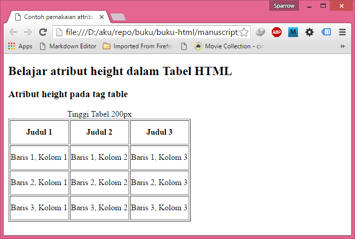

Contoh Cara Merubah dan Mengatur Tinggi Baris
Tabel (atribut height) HTML 1Pada contoh kode HTML diatas saya
menambahkan atribut `height="200px"` pada tag table, sehingga web browser
membagi tinggi 200px itu kepada seluruh baris yang ada.

Untuk pengaturan tinggi kolom yang lebih spesifik, kita dapat mengatur
tinggi masing-masing baris dengan cara menempatkan atribut height pada
setiap tag `tr`. Berikut contoh penggunaan atribut height pada tag tr:

```html
<!DOCTYPE html>
<html>
<head>
<title>Contoh pemakaian attribut height dalam Tabel HTML</title>
</head>
<body>
<h2>Belajar atribut height dalam Tabel HTML</h2>
<h3>Atribut height pada tag tr</h3>
<table border="1" >
<caption>---Baris 1 = 20px, Baris 2 = 40px, Baris 3 = 60px--</caption>
<tr height="20px">
<th>Judul 1</th>
<th>Judul 2</th>
<th>Judul 3</th>
</tr>
<tr height="40px">
<td>Baris 1, Kolom 1</td>
<td>Baris 1, Kolom 2</td>
<td>Baris 1, Kolom 3</td>
</tr>
<tr height="60px">
<td>Baris 2, Kolom 1</td>
<td>Baris 2, Kolom 2</td>
<td>Baris 2, Kolom 3</td>
</tr>
<tr height="80px">
<td>Baris 3, Kolom 1</td>
<td>Baris 3, Kolom 2</td>
<td>Baris 3, Kolom 3</td>
</tr>
</table>
</body>
</html>
```

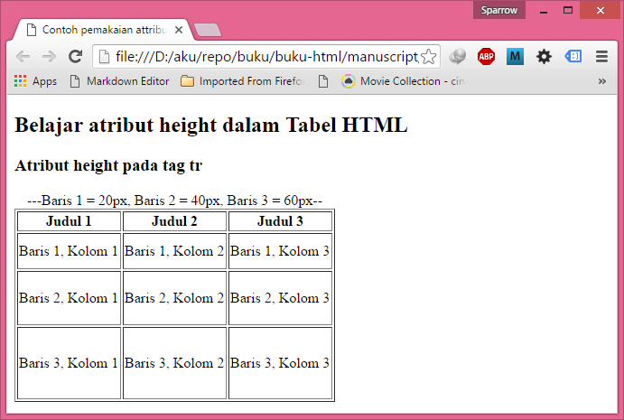

Contoh Cara Merubah dan Mengatur Tinggi Baris
Tabel (atribut height) HTML 2Seperti yang terlihat, bahwa ketiga baris
pada tabel diatas memiliki tinggi yang berbeda-beda, karena kita
menambahkan atribut `height="20px"` pada baris pertama, height="40px" pada
baris kedua, dan `"height=60px"` pada baris ketiga.

Sebagai catatan, seandainya total tinggi dari seluruh baris (atribut
height pada tag tr) melebihi tinggi tabel (atribut height pada tag
table), maka atribut height pada tag tabel akan diabaikan, dan tabel
ditampilkan dengan ukuran height pada tag tr. Namun jika ukuran height
pada tag tabel melebihi total height dari tag tr, maka ukuran tabel akan
ditampilkan "proporsional" mengikuti height dari tabel. Sehingga untuk
menghindari tampilan yang tidak diinginkan, pastikan agar total tinggi
baris tidak melebihi nilai `height` tabel.

## Komentar di HTML

Seperti pada bahasa pemograman lainnya, umumnya kita akan sering lupa
tentang cara kerja kode yang kita buat sendiri setelah beberapa bulan
berikutnya. Untuk mengatasinya, kita bisa akan menyisipkan penjelasan
pada sebuah komentar di sekitar kode tersebut. HTML juga mempunyai tag
khusus untuk komentar. Dalam tutorial belajar HTML: cara menambahkan
komentar di HTML ini kita akan membahasnya lebih dalam.

Cara Membuat Komentar di HTML Untuk membuat komentar di HTML, kita
menggunakan awalan `<!--` dan penutup `-->`. Agar lebih mudah dipahami,
langsung saja kita simak dalam bentuk contoh. Silahkan tulis kode HTML
berikut dan save sebagai komentar.html

Contoh penggunaan tag komentar HTML:

```html
<!DOCTYPE html> 
<html> 
<head> 
<title>Belajar
Tag Komentar (comment)</title> 
</head> 
<body> 
<!--
<p>
Ini berada di dalam tag komentar, dan tidak akan tampil di
browser</p>

 -->
<p>Ini bukan komentar, dan akan tampil di
browser</p> 
</body> 
</html>
```
 Dari contoh dapat dilihat
bahwa tag pembuka komentar adalah `<!--` dan tag penutup `-->`.

Tag komentar ini juga akan berlaku selama belum di temukan tag penutup.
Contohnya dapat dilihat dari kode berikut:

```html
<!DOCTYPE html> 
<html>
 <head> 
 <title>Belajar TagKomentar (comment)</title>
  </head> <body>
   <!-- <p>Ini berada di dalam tag komentar, dan tidak akan tampil di
browser</p> <p> Ini juga tidak tampil di browser</p> -->
 <p>Ini bukan komentar, dan akan tampil di browser</p>

<!-- <p>Ini juga tidak tampil di browser</p> -->

</body> </html>
```

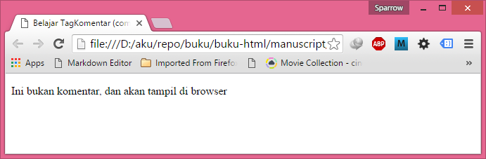

Selain sebagai pengingat atau catatan, tag komentar juga akan berguna
untuk membuat sebagian isi web tidak tampil untuk sementara. hal ini
sangat berguna jika kita ingin mencoba berbagai tampilan kode HTML yang
akan dibuat, tetapi tidak ingin menghapus kode sebelumnya.
