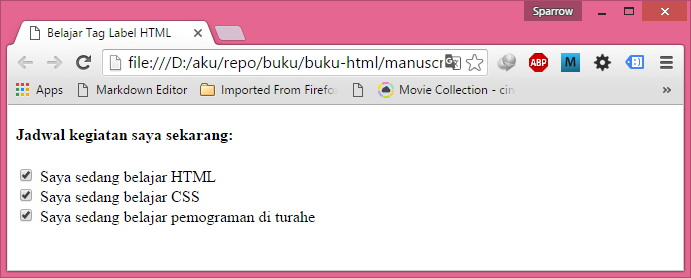
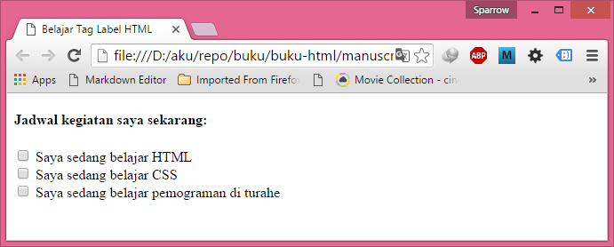
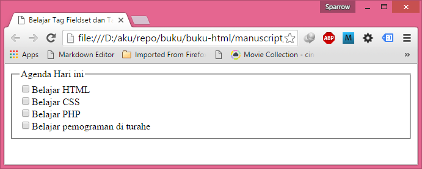
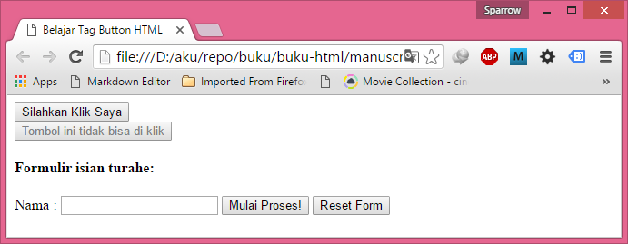

Pada tutorial Belajar HTML Dasar: Cara Membuat Form di HTML (tag form) anda telah mempelajari cara membuat form sederhana di dalam HTML. Dalam penggunaannya, HTML masih memiliki banyak tag dan atribut yang dapat digunakan untuk membuat form yang lebih kompleks.

Dalam 10 tutorial khusus tentang pembuatan form HTML ini, anda dapat mempelajari lebih dalam tentang tag dan atribut pembuatan form HTML, mulai dari tag input type text, checkbox, radio, sampai type file, image dan hidden.

Diharapkan dengan 10 tutorial Pembuatan Form HTML ini, anda bisa menguasai penggunaan form di dalam HTML.

Tag pertama yang akan kita pelajari dalam Tutorial Form HTML ini adalah tentang fungsi dan cara penggunaan tag label.

## Fungsi tag label Dalam Pembuatan Form HTML

Tag label dalam HTML berfungsi sebagai pelengkap keterangan untuk beberapa objek form seperti radio atau checkbox. Selain memberikan keterangan, tag label juga memudahkan penggunan dalam memasukkkan data (membuat form menjadi user friendly).

Secara tampilan, tag label tidak akan berpengaruh apa-apa di dalam form (kecuali anda mengubahnya menggunakan CSS). Sehingga tanpa atau dengan tag label, anda tidak akan melihat perbedaannya.

Untuk memahami kegunaan tag label, silahkan jalankan contoh kode form HTML berikut ini:

```html
<!DOCTYPE html>
<html>
<head>
   <title>Belajar Tag Label HTML</title>
</head>
 
<body> 
   <h4>Jadwal kegiatan saya sekarang: </h4>
 
   <form action="daftar.php" method="post">
 
   <input type="checkbox" name="belajarhtml" id="belajarhtml"
   value="belajarhtml"/> Saya sedang belajar HTML
   <br />
 
   <input type="checkbox" name="belajarcss" id="belajarcss"
   value="belajarcss"/> Saya sedang belajar CSS
   <br />
 
   <input type="checkbox" name="turahe" id="turahe"
   value="turahe"/> Saya sedang belajar pemograman di turahe
 
   </form>
</body>
</html>
```



Dari contoh kode form HTML diatas, saya membuat 3 isian checkbox sederhana. Ketika kita “mencheklist" salah satu dari checkbox tersebut, cara yang paling banyak digunakan adalah dengan men-klik kotak putih pada checkbox tersebut.

Namun kotak checkbox tersebut cukup kecil, dan akan sedikit menyulitkan untuk mengklik-nya.

Salah satu cara agar lebih mudah bagi kita (dan juga bagi pengguna) untuk memilih checkbox tersebut adalah jika pengisian checkbox bisa dilakukan dengan men-klik tulisan keterangan dari checkbox tersebut.

Untuk keperluan inilah tag label digunakan.

### Cara Penggunaan tag label HTML

Terdapat 3 cara penggunaan tag label. Cara pertama dan juga paling sederhana adalah dengan memasukkan atau “mengurung" seluruh tag input checkbox kedalam tag label seperti kode berikut ini:

```html
<label>
   <input type="checkbox" name="belajarhtml" id="belajarhtml"
   value="belajarhtml"/>Saya sedang belajar HTML
</label>
```

Dengan memasukkan seluruh tag input checkbox dan keterangannya ke dalam tag label, maka kita bisa men-klik tulisan keterangan dari checkbox, dan secara otomatis checkbox tersebut akan terisi.

Silahkan anda langsung mengubah kode kita sebelumnya, dan tambahkan tag label.

Cara kedua untuk menggunakan tag label adalah menggunakan atribut “for". Dengan menggunakan atribut for ini, maka kita tidak harus memasukkan seluruh tag input ke dalam tag label. Berikut contoh penggunaannya:

```html
<input type="checkbox" name="belajarcss" id="belajarcss" value="belajarcss"/>
<label for="belajarcss">Saya sedang belajar CSS</label>
```

Perhatikan bahwa tag label diletakkan setelah tag input checkbox. Di dalam tag label ini terdapat sebuah atribut for, yang nilainya adalah id dari tag input. Didalam contoh ini saya membuat atribut id="belajarcss" di dalam tag input checkbox.  Sehingga dalam pembuatan labelnya, saya memberikan nilai atribut  for="belajarcss".

Cara ketiga untuk penggunaan tag label adalah dengan menggabungkan kedua cara diatas. Perhatikan contoh berikut:

```html
<label for="turahe">
 <input type="checkbox" name="turahe" id="turahe" value="turahe"/>
 Saya sedang belajar pemograman di turahe
</label>
```

Di dalam contoh tersebut saya menggabungkan penggunaan atribut for untuk tag label, namun juga “mengurung" tag input checkbox dengan tag label.

Sebagai contoh utuh dari form kita, berikut adalah contoh form sebelumnya dengan tambahan tag label:


```html
<!DOCTYPE html>
<html>
<head>
   <title>Belajar Tag Label HTML</title>
</head>
 
<body>
   <h4>Jadwal kegiatan saya sekarang: </h4>
 
   <form action="daftar.php" method="post">
 
   <label>
      <input type="checkbox" name="belajarhtml" id="belajarhtml"
      value="belajarhtml"/> Saya sedang belajar HTML
   </label>
   <br />
 
   <input type="checkbox" name="belajarcss" id="belajarcss"
   value="belajarcss"/>
   <label for="belajarcss"> Saya sedang belajar CSS</label>
   <br />
 
   <label for="turahe" >
      <input type="checkbox" name="turahe" id="turahe"
      value="turahe"/> Saya sedang belajar pemograman di turahe
   </label>
 
   </form>
</body>
</html>
```



Silahkan anda mencoba menjalankan kode tersebut, dan jika anda men-klik tulisan keterangan dari checkbox, maka secara langsung kotak checkbox akan berisi. Hal seperti ini akan lebih memudahkan user dalam mengisi form yang kita rancang.

Di dalam beberapa referensi, anda disarankan menggunakan cara penulisan tag label yang kedua, yakni dimana kita memisahkan tag label dari tag input, dan menggunakan atribut for sebagai “pengikat" label. Dengan cara ini, form akan lebih fleksibel.


##Tag Fieldset dan Tag Legend dalam pembuatan Form HTML

Fungsi tag fieldset dan tag label lebih kepada tampilan form, karena akan memudahkan dan mempercantik form yang dibuat.

Tag Fieldset berfungsi untuk mengelompokkan beberapa objek form menjadi sebuah kelompok, sedangkan Tag Legend berfungsi untuk menampilkan judul dari kelompok objek form tersebut.

Berikut adalah tampilan form HTML yang dikelompokkan menggunakan tag Fieldset dan tag Legend:

Tutorial Pembuatan Form HTML - Fungsi dan Cara Penggunaan Tag Fieldset dan Tag Legend

Dari gambar diatas dapat dilihat bahwa pilihan dari checkbox yang ada dikelompokkan kedalam kelompok “Agenda hari ini", dan browser akan menampilkannya dalam sebuah kotak.

### Cara Penggunaan Tag Fieldset dan Tag Legend

Untuk dapat membuat tampilan seperti gambar diatas, kita tinggal menambahkan tag fieldset dan tag legend di awal form. Format dasar penulisannya adalah sebagai berikut:

```html
<form action="daftar.php" method="post">
   <fieldset>
   <legend>Judul pada kelompok objek</legend>
   ...kelompok objek form...
   </fieldset>
</form>
```



tag fieldset dan tag legend harus digunakan berpasangan, karena keduanya saling berkaitan. Tag fieldset berfungsi untuk menandai sampai dimana kotak fieldset akan dibuat, sedangkan tag legend berfungsi untuk memberikan judul dari fieldset tersebut.

Berikut adalah contoh kode HTML untuk penggunaan tag fieldset dan tag legend:

```html
<!DOCTYPE html>
<html>
  
<head>
   <title>Belajar Tag Fieldset dan Tag Legend HTML</title>
</head>
 
<body>
 
   <form action="daftar.php" method="post">
   <fieldset>
    
   <legend>Agenda Hari ini</legend>
 
     <input type="checkbox" name="belajarhtml" id="belajarhtml"
     value="belajarhtml"/>Belajar HTML
     <br />
 
     <input type="checkbox" name="belajarcss" id="belajarcss"
     value="belajarcss"/>Belajar CSS
     <br />
 
     <input type="checkbox" name="php" id="belajarphp"
     value="belajarphp"/>Belajar PHP
     <br />
 
     <input type="checkbox" name="turahe" id="turahe"
     value="turahe"/>Belajar pemograman di turahe
 
   </fieldset>
   </form>
 
</body>
</html>
```


Hasil tampilan kode diatas akan sama dengan tampilan di awal tutorial ini.

### Cara merubah rata text tag legend: atribut align

Jika anda perhatikan, tag legend secara default berada di sisi kiri form, namun anda bisa merubah settingan ini dengan menambahkan atribut align pada tag legend.

```html
<legend align="right">Agenda Hari ini</legend>
```

Nilai dari atribut align ini bisa salah satu dari: left, center, right, top dan bottom. Anda bisa mencoba kelima nilai ini, namun nilai top dan bottom umumnya tidak di support oleh web browser.

Karena atribut align ini sangat berkaitan dengan CSS, sebaiknya anda menggunakan CSS untuk mengatur align dari tag legend.

Tag fieldset dan tag legend yang kita pelajari disini lebih berfungsi untuk tampilan dari form, namun form yang tertata dan terkelompok dengan baik akan memudahkan user dalam menggunakannya.

## Tag Button dalam pembuatan Form HTML

Di dalam tutorial Belajar HTML Dasar: Cara Membuat Form di HTML (tag form), kita telah menggunakan tag input dengan type="submit" untuk membuat tombol di dalam form HTML, namun HTML menyediakan tag khusus yang memiliki fungsi sama, yakni tag button.

Tag button berfungsi untuk membuat tombol baik itu di dalam form, maupun diluar form. Dibandingkan dengan tombol yang dibuat dengan tag input type="submit", tag button menawarkan fleksibilitas yang lebih.

### Cara Penggunaan Tag Button HTML

Untuk menggunakan tag button, kita cukup menuliskannya dengan struktur dasar sebagai berikut:

```html
<button>text untuk tombol</button>
```

Tag button juga tidak harus berada di dalam form, dan ini memberikan fleksibilitas yang tinggi. Anda bisa memprogramnya menggunakan javascript untuk membuat fungsi lain yang akan dijalankan ketika tombol tersebut di klik.

### Atribut type: Merubah Fungsi Tombol tag button

Jika digunakan di dalam form, kita dapat menambahkan sebuah atribut type untuk merubah fungsi tombol tersebut. Nilai yang bisa digunakan untuk atribut ini adalah reset, submit, dan button. Contoh penulisannya adalah:

```html
<button type="reset">Text untuk tombol</button>
```

Jika menuliskan type="submit", maka ketika tombol di klik, HTML akan mengirimkan nilainya untuk diproses (misalkan dengan PHP), namun jika type="reset", maka jika tombol tersebut di klik, efeknya akan mengosongkan isian form. Type="button" tidak akan berefek apa-apa kedalam fungsi tombol, bahkan mungkin akan sedikit membingungkan menulis : `<button type="button">`

### Atribut disabled: Menonaktifkan tag button

Salah satu atribut penting untuk tag button ini adalah atribut disabled. Atribut ini digunakan untuk mengontrol apakah tombol tersebut bisa digunakan oleh user atau tidak. Atribut ini hanya memiliki 1 nilai, yaitu disabled, sehingga ditulis dengan disabled="disabled".  Cara penulisannya adalah sebagai berikut:

```html
<button disabled="disabled">Text untuk tombol</button>
```

Jika anda menjalankan contoh tersebut di dalam HTML, tombol akan berwarna abu-abu dan tidak bisa di klik oleh user.

Atribut disabled ini bisa diterapkan kepada hampir seluruh objek form, dan biasanya akan diprogram menggunakan javascript untuk mengaktifkan tombol tersebut. Misalkan kita memprogram sebuah tombol yang hanya bisa aktif ketika user telah mengisi seluruh formulir.

### Atribut id dan class: CSS dan Javascript

Selain atribut type dan disabled, kita bisa menggunakan atribut seperti id dan class dalam tag button. Atribut id dan class akan dibutuhkan untuk pemograman HTML menggunakan Javascript dan CSS.

Contoh penggunaan tag button dalam HTML
Sebagai penutup, berikut adalah contoh kode HTML dalam penulisan dan penggunaan tag button:

```html
<!DOCTYPE html>
<html>
  
<head>
   <title>Belajar Tag Button HTML</title>
</head>
 
<body>
 
   <button>Silahkan Klik Saya</button>
   <br />
 
   <button disabled="disabled">Tombol ini tidak bisa di-klik</button>
   <br />
 
   <h4>Formulir isian turahe:</h4>
 
   <form action=" formulir.html" method="get">
 
   Nama : <input type="text" name="nama_user" id="nama_user"/>
 
   <button type="submit">Mulai Proses!</button>
   <button type="reset">Reset Form</button>
 
   </form>
 
</body>
</html>
```



Anda akan menjumpai bahwa penggunaan tag button di dalam HTML tidak hanya terbatas di dalam form. Dalam proses desain website, tag button juga sering diprogram dengan menggunakan javascript.

## Tag Input Type Text dan Type Password dalam pembuatan Form HTML

Secara umum, kedua type tag input ini berfungsi sebagai kolom isian dari user. Dengan perbedaan untuk type=password, text isian tidak akan ditampilkan, namun diganti dengan karakter khusus.

Kedua tag ini biasanya digunakan di dalam form HTML, namun anda juga bisa menggunakannya di luar tag form, terutama jika anda akan memprosesnya menggunakan javascript. Format penulisan paling dasar dari tag input type=”text” dan type=”password” ini adalah:

```html
<input type="text" />
<input type="password"/>
```
Jika anda menjalankan kedua baris tersebut di dalam web browser, akan tampil 2 buat kotak isian yang bisa diisi dengan text. Perbedaan keduanya hanya pada tempilan karakter dari kotak isian tersebut. untuk type=password, text pada kotak isian akan ditampilkan dengan karakter password.


Di dalam contoh dan penjelasan dalam artikel ini, saya hanya menggunakan contoh dan penjelasan untuk tag input type=”text”. Untuk tag input type=”password” caranya persis sama, dan anda bisa merubah semua kode yang ada dari type=”text” menjadi type=”password” sebagai sarana latihan.
Atribut name: Untuk Pemrosesan tag input type text
Selain atribut type yang digunakan sebagai pembeda kedua input, atribut name merupakan atribut paling penting jika anda bermaksud memprosesnya menggunakan form, karena nilai dari atribut inilah yang akan digunakan sebagai nama variabel yang akan diproses oleh web server (biasanya menggunakan PHP).

Berikut adalah contoh penulisan atribut name untuk tag input type=”text”:

```htnl
<form>
   Nama: <input type="text" name="nama_user" />
   Password: <input type="password" name="password_user"/>
</form>
```

Anda boleh bebas memberikan nilai untuk atribut name ini, namun disarankan menggunakan nama yang singkat dan sesuai dengan peruntukannya agar tidak bingung ketika membuat program PHPnya.

Atribut value: Nilai Awal tag input type text
Atribut value digunakan sebagai nilai isian awal untuk input type=”text”. Namun atribut ini bersifat opsional dan anda tidak harus menambahkannya untuk setiap text inputan.

Berikut adalah cara penulisannya:

```html
<input type="text" name="nama_user" value="masukkan nama anda"/>
<input type="password" name="password_user" value="masukkan password anda"/>
```

Menggunakan atribut value untuk tampilan awal form akan membantu user memahami penjelasan untuk apa isian text tersebut, namun biasanya hal ini harus dikombinasikan dengan javascript agar ketika user mulai mengisi text, kotak text akan langsung kosong. Jika tidak, maka terpaksa user harus mengapus nilai awal ini secara manual.

Dalam pemprosesan form oleh web server nantinya, nilai dari atribut value inilah yang akan diproses. Sehingga jika user langsung men-klik tombol submit form tanpa mengisi apa-apa, maka nilai nama yang dikirim adalah =”masukkan nama anda”. Untuk menghindari hal ini anda bisa membuat program javascript untuk menvalidasi isian form sebelum dikirim ke web server.

Berikut adalah contoh penggunaan atribut value dalam tag input type=”text” HTML

```html
<!DOCTYPE html>
<html>
  
<head>
   <title>Belajar Tag Input Type=text HTML</title>
</head>
 
<body>
 
   <h4>Belajar tag Input type="text" duniailkom:</h4>
   <form>
 
   Nama User :<input type="text" name="nama_user" value="masukkan nama anda"/>
   <br/>
 
   Password User :<input type="password" name="password_user"
   value="masukkan password anda"/>
 
   </form>
</body>
</html>
```

Tutorial Pembuatan Form HTML - Contoh Cara Penggunaan Tag Input Type Text dan Type Password

Atribut size: Mengatur Panjang Tampilan
Atribut size untuk tag input type=”text” digunakan untuk membatasi panjang dari kotak isian. Nilai dari atribut ini adalah berapa pixel panjang kotak isian tersebut.

Berikut cara penulisan atribut size:

```html
<input type="text" name="nama_user" size="4"/>
```

Berikut adalah contoh kode HTML penggunaan atribut size:

```html
<!DOCTYPE html>
<html>
  
<head>
   <title>Belajar Tag Input Type=text HTML</title>
</head>
 
<body>
 
   <h4>Belajar tag Input type="text" duniailkom:</h4>
   <form>
 
   Size = 04 pixel :
   <input type="text" name="nama_user" size="4"/>
   <br/>
 
   Size = 10 pixel :
   <input type="text" name="nama_user" size="10"/>
   <br/>
 
   Size = 20 pixel :
   <input type="text" name="nama_user" size="20"/>
 
   </form>
</body>
</html>
```

Tutorial Pembuatan Form HTML - Contoh Cara Penggunaan Tag Input Type Text Atribut Size

Atribut maxlength: Membatasi Panjang Karakter Maksimum
Atribut maxlegth digunakan untuk membatasi seberapa banyak karakter yang dapat diinput kedalam kotak isian. Nilai dari atribut ini adalah banyak maksimum karakter yang bisa diketik. Berikut adalah cara penulisan atribut ini:

```html
<input type="text" name="id_user" maxlength="4"/>
```

Dengan memberikan atribut maxlength=”4″, maka ketika user mengetikkan karakter ke 5, karakter tersebut tidak akan bisa diinput. Hal ini cukup penting jika kita membutuhkan panjang karakter yang telah dibatasi untuk inputan form, misalkan untuk password yang dibatasi sebanyak 6 karakter.

Namun anda tidak bisa mengandalkan pembatasan atribut maxlength ini, karena user bisa saja membuat script untuk mengubah nilainya. Atribut maxlength ini sebaiknya digunakan sebagai pelengkap. Proses pengecekan pembatasan karakter sebaiknya dilakukan juga pada saat form akan diproses di sisi web server (menggunakan PHP).

Berikut adalah contoh kode HTML penggunaan atribut maxsize:

```html
<!DOCTYPE html>
<html>
  
<head>
   <title>Belajar Tag Input Type=text HTML</title>
</head>
 
<body>
 
   <h4>Belajar tag Input type="text" duniailkom:</h4>
   <form>
 
   Size = 04 pixel, maxlength = 04 :
   <input type="text" name="nama_user" size="4" maxlength="4"/>
   <br/>
 
   Size = 10 pixel, maxlength = 05 :
   <input type="text" name="nama_user" size="10" maxlength="5"/>
   <br/>
 
   Size = 20 pixel, maxlength = 10 :
   <input type="text" name="nama_user" size="20" maxlength="10"/>
 
   </form>
 
</body>
</html>
```

Tutorial Pembuatan Form HTML - Contoh Cara Penggunaan Tag Input Type Text Atribut Maxlength

### Atribut disabled dan readonly: Menonaktifkan tag input
Atribut disabled dan readonly digunakan untuk membuat kotak isian text tidak bisa digunakan. Penggunaan atribut ini biasanya di kombinasikan dengan javascript agar berfungsi maksimal. Misalkan sebuah kotak isian hanya dapat diisi ketika user telah mengisi kotak isian lainnya.

Kedua atribut ini hanya memiliki 1 nilai, yaitu dirinya sendiri, yang ditulis dengan disabled=”disabled” dan readonly =“readonly”. Berikut contoh penulisannya:

```html
<input type="text" name="nama_user" readonly="readonly" />
<input type="text" name="nama_user" disabled="disabled" />
```

Walaupun kedua text yang memiliki atribut ini tidak bisa digunakan, namun keduanya akan memiliki tampilan yang berbeda. Atribut disabled akan membuat kotak text berwarna abu-abu, sedangkan atribut readonly tampak seperti kotak text biasa. Sehingga biasanya atribut disabled lah yang sering digunakan, karena akan memberikan tampilan kepada user bahwa kotak text tersebut tidak bisa digunakan.

Perbedaan lain adalah user masih dapat men-copy isian text isian ketika atributnya diset menjadi readonly. Namun tidak untuk atribut disabled.

Berikut adalah contoh penggunaan atribut disabled dan readonly dalam HTML:

```html
<!DOCTYPE html>
<html>
  
<head>
   <title>Belajar Tag Input Type=text HTML</title>
</head>
 
<body>
 
   <h4>Belajar tag Input type="text" duniailkom:</h4>
   <form>
 
   User name (normal) :
   <input type="text" name="nama_user"/>
   <br/>
 
   User name (readonly) :
   <input type="text" name="nama_user" readonly="readonly" />
   <br/>
 
   User name (disabled) :
   <input type="text" name="nama_user" disabled="disabled" />
 
   </form>
</body>
</html>
```

Tutorial Pembuatan Form HTML - Contoh Cara Penggunaan Tag Input Type Text Atribut Readonly dan Disabled

### Atribut id dan class: CSS dan Javascript

Selain atribut type, value, size, maxlength, readonly dan disabled, kita juga bisa menggunakan atribut seperti id dan class dalam tag input type=”text”. Tag id dan class akan dibutuhkan untuk pemograman HTML menggunakan Javascript dan CSS.

### Cara Penggunaan Tag Input type text dan type password

Sebagai penutup, saya akan membuat beberapa tag input untuk merangkum apa yang telah kita pelajari dalan tutorial kali ini, berikut cara penggunaan tag input type text dan type password dalam HTML:

```html
<!DOCTYPE html>
<html>
  
<head>
   <title>Belajar Tag Input Type=text HTML</title>
</head>
 
<body>
 
   <h4>Belajar tag Input type="text" di duniailkom.com:</h4>
   <form>
 
   Tag Input dengan atribut value :
   <input type="text" name="nama_user" value="masukkan nama anda"/>
   <br/>
 
   Tag Input dengan atribut size = 4 :
   <input type="text" name="nama_user" size="4"/>
   <br/>
 
   Tag Input dengan atribut maxlength = 5 :
   <input type="text" name="nama_user" maxlength="5" />
   <br/>
 
   Tag Input dengan atribut readonly :
   <input type="text" name="nama_user" readonly="readonly"/>
   <br/>
 
   Tag Input dengan atribut disabled :
   <input type="text" name="nama_user" disabled="disabled" />
   <br/>
 
   </form>
</body>
</html>
```

Tutorial Pembuatan Form HTML - Contoh Cara Penggunaan Tag Input Type Text Finish

Objek form berupa text inputan yang dibuat dengan tag input type text ini mungkin merupakan inputan form yang akan paling sering anda gunakan. Selain memahami atribut-atribut HTML yang digunakan untuk merancang form, di dalam tutorial cara pembuatan form HTML dengan tag input type text ini anda juga telah mempelajari contoh penggunaannya.


## tag input type checkbox dalam Pembuatan Form HTML